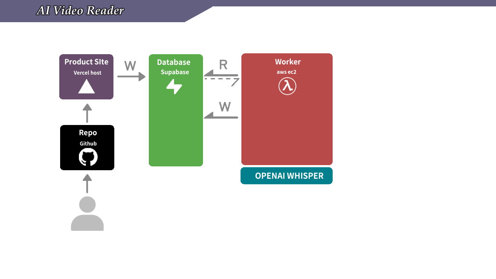

# M1 — AI 影片摘要核心 (對應 2.2 打造 AI 影片摘要核心功能)

## What this skill does

Walks the student through Course 2 Milestone 1 end-to-end. By the end the student has:

1. A Next.js 16 app on Vercel (M0's Vite SPA converted) with a real `/upload` page behind auth.
2. A Supabase schema with `jobs` + `job_sessions` (TXT-only — no SRT/VTT/reviewed columns).
3. A Next.js route handler `app/api/jobs/route.ts` that authenticates the user and enqueues a job row.
4. A tiny Python worker (~120 lines) on the EC2 from M1 prerequisites: polls Supabase, downloads the video with yt-dlp, splits with ffmpeg, calls OpenAI Whisper, writes the TXT back to `job_sessions`.
5. End-to-end: a signed-in user pastes a YouTube URL → 1–3 minutes later a transcript appears in `job_sessions.subtitle_txt_content`.

**Out of scope for M1 (deferred to later milestones):**
- SRT / VTT outputs
- LLM cleanup steps (block-combining, spacing, typo check, semantic fix, contextual proofreading)
- Human review (`*_reviewed` columns)
- Error recovery / stuck-job restart
- Stripe credits / metering
- Custom domain (M3) / serverless distributor (M4)

## When to load this skill

Trigger phrases:
- 「啟動 M1」 / "start M1" / "begin M1"
- 「M1 跑起來」 / 「我要做 M1」
- 「打造 AI 影片摘要核心功能」
- Any prompt the student gives that references Course 2 module 2.2

Do NOT load this skill for M0 or M2–M4 — they have their own skills.

## Required external accounts

Before starting, the student must have everything from M0 plus the M1 additions:

| # | Service | Used for | Added in |
|---|---|---|---|
| 1 | GitHub | Source control | M0 |
| 2 | Lovable | UI generation + Vite→Next.js conversion | M0 |
| 3 | Supabase | Auth + Postgres + RLS | M0 |
| 4 | Vercel | Auto-deploy Next.js | M0 |
| 5 | **OpenAI** | Whisper (`whisper-1`) | **M1** |
| 6 | **AWS** | One Ubuntu EC2 (t3.small) for the worker | **M1** |

If 5 or 6 is missing, **stop and load `m1-ai-video-transcript-prerequisites` first**. Do not try to proceed without OpenAI key + EC2.

## Execution mode: Cowork vs CLI (confirm before Step 1)

Before starting, ask the student: 「你是用 Cowork 還是本機 CLI 跑 Claude Code？」 Then apply the right column for every step below.

| Operation | Cowork mode | CLI mode |
|---|---|---|
| Apply the Supabase migration (Step 2) | `mcp__supabase_remote__apply_migration` (gated by 'ask' permission) | `supabase db push` after dropping the SQL into `supabase/migrations/` |
| Save migration to git for history (Step 2) | Write the .sql via Lovable's editor (or commit via GitHub web UI) | `git add supabase/migrations/<file>.sql && git commit && git push` |
| Inspect tables / row state | `mcp__supabase_remote__list_tables` / `execute_sql` | `supabase db execute` or dashboard |
| Edit the Next.js code (Steps 1, 3, 4) | Edit through Lovable's editor; commit via Lovable's Git panel | Edit locally with Claude Code Edit/Write, `git push` |
| Push to GitHub | Lovable auto-syncs on save | `git push origin main` |
| Run commands on the EC2 (Step 6) | `call_aws ssm send-command` via AWS API MCP — **no SSH** | Same: `aws ssm send-command` from local terminal |
| Verify Vercel deploy | `mcp__vercel__*` | Browser to `<vercel-url>` or `vercel inspect` |

The conversational flow below is the same in both modes — only the tool choices differ. **There is no SSH path** in either mode; M1 prereq stood up an SSM-managed EC2 specifically so we don't need it.

## How the code is organized + how it deploys

Before walking the steps, the student should understand the moving parts. M1 is unusual in that it deploys *one repo* to *two completely different runtimes* — Next.js to Vercel, Python to EC2 — without Docker, CI, or SSH.



*User → GitHub repo → Vercel-hosted Next.js writes to Supabase; AWS EC2 worker reads pending jobs, runs OpenAI Whisper, writes transcripts back.*

### One repo, two deploy targets

Everything lives in the **same GitHub repo** the student created in M0. M1 just adds a `worker/` subdirectory:

```
<student-repo>/
├── app/                           ← Next.js web app (M0 + M1 Step 4 added /api/jobs)
│   └── api/jobs/route.ts
├── supabase/migrations/
│   └── 20260513000000_m1_jobs_and_sessions.sql       ← M1 Step 2
├── worker/                        ← all of this is M1 Step 5
│   ├── requirements.txt
│   ├── worker.py
│   ├── distributor.py
│   └── m1-distributor.service     ← systemd unit
└── ...
```

- **Vercel** auto-deploys `app/` on every `git push`. It ignores `worker/` (no build hook).
- **The EC2** pulls `worker/` via `git pull`. It ignores `app/`.

One repo, two runtimes, zero coordination needed between the two deploys — they happen independently.

### How `worker/` reaches the EC2 — the deploy model

**GitHub is the artifact registry. AWS SSM `send-command` is the deploy mechanism. systemd is the process supervisor.** No Docker, no CI workflow, no SSH key.

The full update loop, from "I edited `worker.py`" to "the new code is running on EC2":

1. **Author** the code (Cowork: edit via Lovable's editor or Claude's Edit tool; CLI: edit locally with Claude Code).
2. **Push** to GitHub (Lovable auto-syncs on save; CLI: `git push origin main`).
3. **Pull on the EC2** via Cowork — *one* MCP call:
   ```
   call_aws ssm send-command --instance-ids "$INSTANCE_ID" --document-name AWS-RunShellScript \
     --parameters 'commands=[
       "sudo -u ubuntu bash -c \"cd /home/ubuntu/app && git pull\"",
       "sudo -u ubuntu bash -c \"cd /home/ubuntu/app/worker && ./venv/bin/pip install -r requirements.txt\""
     ]'
   ```
4. **Restart the systemd service** — *one more* MCP call:
   ```
   call_aws ssm send-command --instance-ids "$INSTANCE_ID" --document-name AWS-RunShellScript \
     --parameters 'commands=["sudo systemctl restart m1-distributor.service"]'
   ```

That's the entire deploy. No `scp`, no `ssh`, no Dockerfile, no GitHub Actions workflow, no CodeDeploy.

### Where each piece was set up

| Piece | Set up in | Lives at |
|---|---|---|
| EC2 instance + IAM role + Secrets Manager | M1 prereq §2.0–2.7 | AWS account |
| `~/app` (the M0 repo cloned to EC2) | M1 prereq §2.7 | EC2 `/home/ubuntu/app` |
| `worker/venv` (Python 3.12 venv) | M1 prereq §2.7 | EC2 `/home/ubuntu/app/worker/venv` |
| `worker/*.py` + `requirements.txt` + `*.service` (initial commit) | M1 main Step 5 | GitHub repo `worker/` |
| `m1-distributor.service` installed at `/etc/systemd/system/` + enabled | M1 main Step 6b | EC2 systemd |
| `pip install -r requirements.txt` (initial) | M1 main Step 6a | EC2 venv |

After the initial Step 6 setup, every subsequent code change uses just the two-MCP-call loop above. That's the model — internalize it before reading the step-by-step below, because Steps 5–6 are the **first** time through this loop, not the only time.

### Things this deploy model deliberately does NOT have

- **No staging environment.** The student `git pull`s `main` directly to the live EC2. Fine for solo learning; revisit if you onboard real users.
- **No automated rollback.** A broken `worker.py` makes systemd restart-loop on import error. Recovery: `git revert` + push + repeat the pull/restart.
- **No CI.** GitHub never builds anything for you. Vercel handles its own auto-deploy of `app/`; the EC2 deploy is fully student-driven via Cowork.
- **No Docker.** Adds a build step + an image registry. M1 skips it; M4 (serverless milestone) brings Docker + ECR back when the worker moves to Fargate.

OK — now the steps.

## Conversational flow

The skill is conversational — drive the student through 7 steps. Don't dump all steps at once. After each step, **wait for confirmation** before moving on.

> **Before Step 1:** confirm the student has done both `m0-landing-page-checklist` (M0 fully green) and `m1-ai-video-transcript-prerequisites`. If either is missing, switch to that skill and come back. Sanity checks before continuing (same in both Cowork and CLI mode):
>
> 1. `mcp__supabase_remote__list_tables` returns the M0 auth schema.
> 2. `mcp__vercel__*` tools are loaded (Cowork) or `vercel whoami` succeeds (CLI).
> 3. AWS API MCP works: `call_aws ssm describe-instance-information --filters "Key=tag:Name,Values=m1-worker"` returns one row with `PingStatus=Online`.
> 4. AWS Secrets Manager has all four M1 secrets: `call_aws secretsmanager list-secrets --query 'SecretList[?Name==\`openai-api-key\` || Name==\`supabase-url\` || Name==\`supabase-secret-key\` || Name==\`supabase-publishable-key\`].Name'` returns the four names. (The worker.py / distributor.py code in Step 5 only reads three of them — the publishable key is stored for future-milestone use, see M1 prereq §2.3.)
>
> If any check fails, switch to `m1-ai-video-transcript-prerequisites` and resolve before continuing. **No SSH is used in M1.**

### Step 1 — Convert M0's Vite SPA to Next.js 16

M0 leaves the student on a Vite SPA. M1's API route (`/api/jobs`) needs Next.js route handlers, which Vite doesn't have. We convert with one Lovable prompt.

Tell the student verbatim:

> 「M0 跑出來的是 Vite SPA。M1 要加 server-side API route（讓使用者送出影片時，後端能驗證身份、寫 Supabase），這在純 Vite 做不到 — 我們得轉成 Next.js 16。在 Lovable 跑這個 prompt：」

Then paste this prompt for the student to copy into Lovable verbatim:

```
Convert this project from Vite to Next.js 16 with the App Router. Specifically:

1. Replace vite.config.ts + index.html + src/main.tsx with a Next.js 16 App Router skeleton:
   - app/layout.tsx (root layout — keep the same fonts and dark theme as the existing Vite version)
   - app/page.tsx (the landing page — port from src/App.tsx, keep all hero / features / footer text identical)
   - app/globals.css (move from src/index.css)
2. Migrate Sign In / Sign Up / Sign Out routes to Next.js pages:
   - app/sign-in/page.tsx
   - app/sign-up/page.tsx
   - app/app/page.tsx (the post-login authenticated dashboard placeholder)
3. Use @supabase/ssr (NOT just @supabase/supabase-js) so server components and route handlers can read the user session from cookies. Add:
   - lib/supabase/client.ts — browser-side createBrowserClient
   - lib/supabase/server.ts — server-side createServerClient that reads cookies
4. Add middleware.ts at the project root that calls supabase.auth.getUser() to keep the session refreshed between requests.
5. package.json scripts: dev = "next dev --port 3000", build = "next build", start = "next start". Bump react/react-dom to ^19, add "next": "^16". Remove all Vite + TanStack + Cloudflare deps.
6. Keep all the visual design from the Vite version. The landing page text, hero, features, footer should look identical to the deployed M0 page. Sign-up / sign-in / sign-out flows must continue to work end-to-end against the same Supabase project.

After this conversion:
- `npm run build` should produce a .next directory.
- Vercel should auto-detect Framework Preset = Next.js (NOT Vite) on the next push.
- Sign-up / sign-in / sign-out must still work in the Lovable preview AND on the Vercel deploy.
```

**Verify before moving on:**

- Lovable preview: sign-up / sign-in / sign-out still work.
- The repo now contains an `app/` directory and `package.json` shows `"next": "^16.x"` (CLI mode: `gh api repos/<owner>/<repo>/contents/package.json --jq '.content' | base64 -d | grep '"next"'`; Cowork mode: open `package.json` on github.com).
- Vercel re-deploys after the conversion commit lands. The Vercel project's Framework Preset should auto-flip to **Next.js** — if it doesn't, manually set it (Vercel project → Settings → General → Framework Preset → Next.js).
- After the Vercel re-deploy, sign-up / sign-in still work on the live URL.

If sign-up breaks: re-prompt Lovable with 「Sign-up flow broke after the Next.js conversion. Restore Supabase auth using @supabase/ssr — make sure middleware.ts refreshes the session cookie and that the Sign In page reads from lib/supabase/server.ts. Keep the project as Next.js 16 App Router.」

### Step 2 — Apply the M1 Supabase schema (and save it to git)

We add two tables (`jobs`, `job_sessions`) plus RLS policies. Per `supabase-best-practice` Rule 1, **schema changes always go in as a migration file** — even when we apply via MCP, we still commit the .sql to git so the change is reproducible.

The file goes in **both places**:
- **In the repo:** `supabase/migrations/20260513000000_m1_jobs_and_sessions.sql` (so the change is in git history forever)
- **Applied to remote Supabase:** via `mcp__supabase_remote__apply_migration` (Cowork; one-shot, no need for `supabase` CLI auth) OR `supabase db push` (CLI)

The migration name passed to MCP is `m1_jobs_and_sessions`.

```sql
-- M1 schema: jobs + job_sessions (TXT-only, no SRT/VTT/reviewed)

create table public.jobs (
  id uuid primary key default gen_random_uuid(),
  user_id uuid not null references auth.users(id) on delete cascade,
  created_at timestamptz not null default now(),
  updated_at timestamptz not null default now(),
  video_source_url text not null,
  topic text,
  language text not null default 'zh',
  status text not null default 'pending'
    check (status in ('pending', 'downloading', 'transcribe', 'done')),
  current_session_id uuid
);

create table public.job_sessions (
  id uuid primary key default gen_random_uuid(),
  job_id uuid not null references public.jobs(id) on delete cascade,
  session_number int not null default 1,
  created_at timestamptz not null default now(),
  subtitle_txt_content text
);

alter table public.jobs
  add constraint fk_current_session
  foreign key (current_session_id) references public.job_sessions(id);

-- RLS: users only see their own jobs + sessions.
-- The worker connects with the Supabase Secret key (sb_secret_*) and bypasses RLS.
alter table public.jobs enable row level security;
alter table public.job_sessions enable row level security;

create policy "users read own jobs" on public.jobs
  for select using (auth.uid() = user_id);

create policy "users insert own jobs" on public.jobs
  for insert with check (auth.uid() = user_id);

create policy "users read own sessions" on public.job_sessions
  for select using (
    exists (select 1 from public.jobs j where j.id = job_id and j.user_id = auth.uid())
  );
```

Apply + commit (both modes):

1. **Save the .sql to the repo** at `supabase/migrations/20260513000000_m1_jobs_and_sessions.sql` (Cowork: edit through Lovable, push via Lovable's Git panel; CLI: write the file with Claude Code Edit/Write, `git add`, `git commit -m 'M1 schema'`, `git push`).
2. **Apply to remote Supabase:**
   - **Cowork mode:** call `mcp__supabase_remote__apply_migration` with `name = "m1_jobs_and_sessions"` and `query = <the SQL above>`. Permission gate is "ask" — confirm the prompt.
   - **CLI mode:** `supabase db push` from the student's repo root.

Don't skip step 1 even though step 2 already mutates the database — git is your only audit log of "what does this Supabase project's schema actually look like, and how did it get there?"

**Verify before moving on:**

- `mcp__supabase_remote__list_tables` (or `supabase db dump --schema public`) shows both tables exist.
- **Negative check** — confirm we kept M1 small. These columns must NOT exist anywhere: `subtitle_srt_content`, `subtitle_vtt_content`, any `*_reviewed` column, `error_message`. If any of those appear, the student copied the wrong migration; re-apply this one.
- `select count(*) from jobs` returns 0 (no rows yet).

### Step 3 — Add the `/upload` page in Lovable

Tell the student verbatim:

> 「現在 schema 有了，我們在 web 上加一個 /upload 頁面，讓登入後的使用者可以送出影片 URL。」

Paste this prompt for the student to copy into Lovable:

```
Add a new authenticated page at /upload to the existing Next.js 16 app.

Requirements:

1. Auth-gated. If the user is not signed in, redirect to /sign-in. Use lib/supabase/server.ts to check the session in a Server Component.

2. The page shows two things stacked:

   (a) A list of the signed-in user's existing jobs at the top:
       - Query: select id, created_at, video_source_url, status from jobs where user_id = auth.uid() order by created_at desc limit 20.
       - Render as a table with columns: Created (relative time), URL (truncate to 50 chars), Status (color-coded badge — gray for pending/downloading, blue for transcribe, green for done).
       - If no jobs yet, show a friendly empty state: "No transcriptions yet. Submit your first video below."

   (b) A submission form below the list:
       - Field: Video URL (text input, required, placeholder "https://www.youtube.com/watch?v=...")
       - Field: Topic (text input, optional, placeholder "e.g. Tech podcast — useful context for the model")
       - Field: Language (select, default "zh", options: zh / en / ja)
       - Submit button labeled "Transcribe"
       - On submit, POST to /api/jobs (we'll add the route handler next) with JSON body { video_source_url, topic, language }. On 200 response, refresh the page so the new job appears in the list above. On error, show the error message inline.

3. Visual style matches the M0 landing page (dark theme, purple accent on near-black background, Inter font).

4. Add a link to /upload in the header of /app (the post-login dashboard) so signed-in users can find it.
```

**Verify before moving on:**

- Lovable preview: navigate to `/upload`, see the form, see the empty-state message ("No transcriptions yet...").
- Sign out and try to visit `/upload` directly — should redirect to `/sign-in`.
- Vercel preview deploys; same checks pass on the Vercel URL.

The form's POST will fail with a 404 right now — that's expected. We add the route handler in Step 4.

### Step 4 — Add the `/api/jobs` route handler

Tell the student to create this file in their repo (Cowork mode: edit through Lovable; CLI mode: Claude Code Edit/Write or hand-edit).

**File path:** `app/api/jobs/route.ts`

```ts
import { NextResponse } from 'next/server'
import { createServerClient } from '@supabase/ssr'
import { cookies } from 'next/headers'
import { createClient } from '@supabase/supabase-js'

export async function POST(req: Request) {
  // 1. Authenticate the caller via the cookie session.
  const cookieStore = await cookies()
  const supabase = createServerClient(
    process.env.NEXT_PUBLIC_SUPABASE_URL!,
    process.env.NEXT_PUBLIC_SUPABASE_PUBLISHABLE_KEY!,
    { cookies: { getAll: () => cookieStore.getAll() } }
  )
  const {
    data: { user },
  } = await supabase.auth.getUser()
  if (!user) {
    return NextResponse.json({ error: 'unauthorized' }, { status: 401 })
  }

  const body = await req.json().catch(() => ({}))
  if (!body.video_source_url) {
    return NextResponse.json({ error: 'video_source_url required' }, { status: 400 })
  }

  // 2. Use the Supabase Secret key to insert the job + session rows.
  // The user has already been authenticated above; Secret key bypasses RLS
  // so we can insert in one round-trip without policy ping-pong.
  const admin = createClient(
    process.env.NEXT_PUBLIC_SUPABASE_URL!,
    process.env.SUPABASE_SECRET_KEY!
  )

  const { data: job, error: jobErr } = await admin
    .from('jobs')
    .insert({
      user_id: user.id,
      video_source_url: body.video_source_url,
      topic: body.topic ?? null,
      language: body.language ?? 'zh',
      status: 'pending',
    })
    .select()
    .single()
  if (jobErr) {
    return NextResponse.json({ error: jobErr.message }, { status: 500 })
  }

  const { data: session, error: sessErr } = await admin
    .from('job_sessions')
    .insert({ job_id: job.id, session_number: 1 })
    .select()
    .single()
  if (sessErr) {
    return NextResponse.json({ error: sessErr.message }, { status: 500 })
  }

  await admin
    .from('jobs')
    .update({ current_session_id: session.id })
    .eq('id', job.id)

  return NextResponse.json({ job_id: job.id })
}
```

Add the env vars (Vercel project → Settings → Environment Variables, AND the local `.env.local` for `npm run dev`):

```
NEXT_PUBLIC_SUPABASE_URL=https://<ref>.supabase.co
NEXT_PUBLIC_SUPABASE_PUBLISHABLE_KEY=sb_publishable_...    # browser-safe, RLS-gated
SUPABASE_SECRET_KEY=sb_secret_...                         # server-only, FULL ACCESS — never ship to browser
```

> ⚠️ **`SUPABASE_SECRET_KEY` is a server-only secret.** Never prefix it with `NEXT_PUBLIC_`. Never reference it in a Client Component. Anyone who gets this key has full access to the database, bypassing all RLS.

After adding env vars in Vercel, **redeploy** — Vercel doesn't re-evaluate env vars for already-built deployments.

**Verify before moving on:**

- POST without auth (incognito browser → DevTools → fetch `/api/jobs`) → 401.
- Submit a job through the `/upload` form (signed in) → 200 with `{ job_id }` in the response.
- Verify the row exists:
  - **Cowork mode:** `mcp__supabase_remote__execute_sql` with `select id, status, video_source_url from jobs order by created_at desc limit 1`. Should return the just-submitted row with `status = 'pending'`.
  - **CLI mode:** same query via `supabase db execute` or dashboard.
- Job stays at `pending` indefinitely — no worker yet. That's expected; we add it next.

### Step 5 — Inline the worker code

The worker lives on the EC2 from `m1-ai-video-transcript-prerequisites`. Tell the student:

> 「現在 web 端會把 job 寫進 Supabase 但沒有東西在處理。我們在 EC2 上裝一個 Python worker — 它會 polling pending jobs、下載影片、跑 Whisper、把 TXT 寫回 Supabase。」

The student creates **three files** in their repo (commit + push to GitHub; then in Step 6 we `git pull` them onto the EC2 via SSM):

**`worker/requirements.txt`**

```
openai>=1.0.0
supabase>=2.0.0
boto3>=1.34.0
yt-dlp>=2024.0.0
```

> No `python-dotenv`. The worker reads its secrets from **AWS Secrets Manager** (set up in M1 prereq §2.3) using `boto3`. There is no `.env` file on the EC2 — it would be one more thing to keep out of git, one more thing to rotate when leaked. The IAM instance profile gives the EC2 permission to read four secret names — `openai-api-key`, `supabase-url`, `supabase-secret-key`, `supabase-publishable-key` — and nothing else. (M1's worker.py only fetches the first three; `supabase-publishable-key` is stored for future-milestone use.)

**`worker/worker.py`** (~120 lines, full file):

```python
"""
M1 worker: polls one job at a time, downloads the video, runs Whisper,
writes TXT back to job_sessions.subtitle_txt_content.

Started by distributor.py (one Popen per pending job). Reads JOB_ID from env.
Reads OPENAI_API_KEY / SUPABASE_URL / SUPABASE_SECRET_KEY from AWS Secrets
Manager — the EC2's IAM instance profile grants `secretsmanager:GetSecretValue`
on exactly those three secret names, so no credentials ever live on disk.
"""
import os
import sys
import math
import subprocess
import tempfile
from pathlib import Path

import boto3
from openai import OpenAI
from supabase import create_client


def _get_secret(client, name: str) -> str:
    """Fetch one Secrets Manager secret by name (returns the SecretString)."""
    return client.get_secret_value(SecretId=name)["SecretString"]


def _load_secrets() -> dict[str, str]:
    """Pull the three M1 secrets from AWS Secrets Manager."""
    sm = boto3.client("secretsmanager")
    return {
        "OPENAI_API_KEY": _get_secret(sm, "openai-api-key"),
        "SUPABASE_URL": _get_secret(sm, "supabase-url"),
        "SUPABASE_SECRET_KEY": _get_secret(sm, "supabase-secret-key"),
    }


_secrets = _load_secrets()
db = create_client(_secrets["SUPABASE_URL"], _secrets["SUPABASE_SECRET_KEY"])
openai_client = OpenAI(api_key=_secrets["OPENAI_API_KEY"])

# OpenAI Whisper has a 25 MB file-size limit. 10 minutes of 64 kbps mono mp3 ~= 4.8 MB,
# safely under the limit. Long videos get split into 600-second chunks.
CHUNK_SECONDS = 600


def get_job(job_id: str) -> dict:
    return db.table("jobs").select("*").eq("id", job_id).single().execute().data


def update_job(job_id: str, **fields) -> None:
    db.table("jobs").update({**fields, "updated_at": "now()"}).eq("id", job_id).execute()


def update_session(session_id: str, **fields) -> None:
    db.table("job_sessions").update(fields).eq("id", session_id).execute()


def download_video(url: str, dest_dir: Path) -> Path:
    """yt-dlp for URLs; pass through for local file paths."""
    if url.startswith(("http://", "https://")):
        out_template = str(dest_dir / "video.%(ext)s")
        subprocess.run(["yt-dlp", "-o", out_template, url], check=True)
        return next(dest_dir.glob("video.*"))
    return Path(url).expanduser().resolve()


def to_mp3(video_path: Path, dest_dir: Path) -> Path:
    """Convert any video/audio container to 64 kbps mono 16 kHz mp3 (Whisper-friendly)."""
    mp3 = dest_dir / "audio.mp3"
    subprocess.run(
        [
            "ffmpeg", "-y", "-i", str(video_path),
            "-vn", "-ac", "1",
            "-ar", "16000", "-ab", "64k",
            "-acodec", "libmp3lame",
            str(mp3),
        ],
        check=True,
        capture_output=True,
    )
    return mp3


def get_duration_seconds(audio_path: Path) -> float:
    out = subprocess.run(
        ["ffprobe", "-v", "error", "-show_entries", "format=duration",
         "-of", "default=noprint_wrappers=1:nokey=1", str(audio_path)],
        check=True,
        capture_output=True,
        text=True,
    )
    return float(out.stdout.strip())


def split_chunks(mp3_path: Path, dest_dir: Path) -> list[Path]:
    """Split into CHUNK_SECONDS-second chunks (re-encode to keep sizes predictable)."""
    duration = get_duration_seconds(mp3_path)
    n_chunks = max(1, math.ceil(duration / CHUNK_SECONDS))
    chunks = []
    for i in range(n_chunks):
        chunk = dest_dir / f"chunk_{i:03d}.mp3"
        subprocess.run(
            [
                "ffmpeg", "-y", "-i", str(mp3_path),
                "-ss", str(i * CHUNK_SECONDS),
                "-t", str(CHUNK_SECONDS),
                "-acodec", "libmp3lame",
                "-ab", "64k",
                str(chunk),
            ],
            check=True,
            capture_output=True,
        )
        chunks.append(chunk)
    return chunks


def transcribe_chunk(chunk_path: Path, language: str) -> str:
    with open(chunk_path, "rb") as f:
        return openai_client.audio.transcriptions.create(
            model="whisper-1",
            file=f,
            response_format="text",
            language=language,
        )


def main() -> None:
    job_id = os.environ["JOB_ID"]
    job = get_job(job_id)
    session_id = job["current_session_id"]

    update_job(job_id, status="downloading")
    print(f"[{job_id}] downloading {job['video_source_url']}")

    with tempfile.TemporaryDirectory() as tmp:
        tmp_path = Path(tmp)
        video = download_video(job["video_source_url"], tmp_path)
        mp3 = to_mp3(video, tmp_path)

        update_job(job_id, status="transcribe")
        chunks = split_chunks(mp3, tmp_path)
        print(f"[{job_id}] transcribing {len(chunks)} chunk(s)")

        full_text = "\n\n".join(
            transcribe_chunk(c, job["language"]) for c in chunks
        )

        update_session(session_id, subtitle_txt_content=full_text)
        update_job(job_id, status="done")

    print(f"[{job_id}] done — {len(full_text)} chars")


if __name__ == "__main__":
    main()
```

**`worker/distributor.py`** (~40 lines, full file):

```python
"""
M1 distributor: polls jobs.status='pending' every 10 s, spawns one worker.py
process per pending job. Worker flips status to 'downloading' immediately,
so the next poll skips it.

Reads SUPABASE_URL + SUPABASE_SECRET_KEY from AWS Secrets Manager.
Same auth model as worker.py — IAM instance profile grants
`secretsmanager:GetSecretValue` on the supabase-* secret names.

Known limitation (acceptable for M1): if worker.py crashes BEFORE flipping
to 'downloading', the distributor will spawn another worker on the next poll.
We fix this in M4 with Lambda + Fargate + ARN-based idempotency.
"""
import os
import sys
import time
import subprocess
from pathlib import Path

import boto3
from supabase import create_client


def _load_secrets() -> dict[str, str]:
    sm = boto3.client("secretsmanager")
    return {
        "SUPABASE_URL": sm.get_secret_value(SecretId="supabase-url")["SecretString"],
        "SUPABASE_SECRET_KEY": sm.get_secret_value(SecretId="supabase-secret-key")["SecretString"],
    }


_secrets = _load_secrets()
db = create_client(_secrets["SUPABASE_URL"], _secrets["SUPABASE_SECRET_KEY"])

WORKER = Path(__file__).parent / "worker.py"
PYTHON = sys.executable  # use the same venv we're running in


def poll_once() -> None:
    rows = db.table("jobs").select("id").eq("status", "pending").execute().data
    for row in rows:
        env = {**os.environ, "JOB_ID": row["id"]}
        subprocess.Popen([PYTHON, str(WORKER)], env=env)
        print(f"spawned worker for job {row['id']}", flush=True)


def main() -> None:
    print("distributor: polling every 10s. Ctrl+C to stop.", flush=True)
    while True:
        try:
            poll_once()
        except Exception as e:
            print(f"poll error: {e}", file=sys.stderr, flush=True)
        time.sleep(10)


if __name__ == "__main__":
    main()
```

**Add one more file** — a systemd unit so the distributor runs as a service (no tmux needed; auto-starts on EC2 reboot, restarts on crash):

**`worker/m1-distributor.service`**

```ini
[Unit]
Description=M1 Whisper distributor (polls Supabase, spawns worker.py)
After=network-online.target
Wants=network-online.target

[Service]
Type=simple
User=ubuntu
WorkingDirectory=/home/ubuntu/app/worker
ExecStart=/home/ubuntu/app/worker/venv/bin/python /home/ubuntu/app/worker/distributor.py
Restart=always
RestartSec=5
StandardOutput=append:/var/log/m1-distributor.log
StandardError=append:/var/log/m1-distributor.log
# AWS region for boto3 (SSM client) — set to wherever you launched the EC2
Environment=AWS_DEFAULT_REGION=us-west-2

[Install]
WantedBy=multi-user.target
```

> Update `AWS_DEFAULT_REGION` to match the region the EC2 was launched in (M1 prereq §2.1). `boto3` will fail with `NoRegionError` if it can't determine the region.

**Verify before moving on:**

The student commits all four files (`requirements.txt`, `worker.py`, `distributor.py`, `m1-distributor.service`) to their repo and pushes. CLI mode: `git add worker/ && git commit -m 'M1 worker' && git push`. Cowork mode: edit through Lovable's Git panel or upload via the GitHub web UI.

### Step 6 — Deploy + run the worker on EC2 (via SSM, no SSH)

We do every EC2-side action through `call_aws ssm send-command`. Get the instance ID once and reuse it:

```
INSTANCE_ID=$(call_aws ec2 describe-instances --filters "Name=tag:Name,Values=m1-worker" "Name=instance-state-name,Values=running" --query 'Reservations[0].Instances[0].InstanceId' --output text)
```

#### 6a — Pull the new worker code and install deps

```
call_aws ssm send-command \
  --instance-ids "$INSTANCE_ID" \
  --document-name "AWS-RunShellScript" \
  --comment "M1: pull worker code + install Python deps" \
  --parameters 'commands=[
    "sudo -u ubuntu bash -c \"cd /home/ubuntu/app && git pull\"",
    "sudo -u ubuntu bash -c \"cd /home/ubuntu/app/worker && ./venv/bin/pip install -r requirements.txt\""
  ]'
```

Wait ~30 s, then read the output via `call_aws ssm list-command-invocations --command-id <CommandId> --details --query 'CommandInvocations[0].CommandPlugins[0].Output'`. You should see `Successfully installed openai-... supabase-... boto3-... yt-dlp-...`.

#### 6b — Install the systemd unit and start the service

```
call_aws ssm send-command \
  --instance-ids "$INSTANCE_ID" \
  --document-name "AWS-RunShellScript" \
  --comment "M1: install m1-distributor.service and start it" \
  --parameters 'commands=[
    "sudo cp /home/ubuntu/app/worker/m1-distributor.service /etc/systemd/system/m1-distributor.service",
    "sudo touch /var/log/m1-distributor.log && sudo chown ubuntu:ubuntu /var/log/m1-distributor.log",
    "sudo systemctl daemon-reload",
    "sudo systemctl enable --now m1-distributor.service",
    "sleep 3 && sudo systemctl status m1-distributor.service --no-pager"
  ]'
```

The status output should show `Active: active (running)`. If it shows `failed`, read the log via the next call:

```
call_aws ssm send-command \
  --instance-ids "$INSTANCE_ID" \
  --document-name "AWS-RunShellScript" \
  --parameters 'commands=["sudo journalctl -u m1-distributor.service -n 50 --no-pager"]'
```

Most-common failures and fixes:
- `NoRegionError` → fix `AWS_DEFAULT_REGION` in `m1-distributor.service`, push, repeat 6a + 6b.
- `AccessDeniedException` on `secretsmanager:GetSecretValue` → IAM role missing the `m1-secrets-read` inline policy from M1 prereq §2.3. Re-run that `put-role-policy` call.
- `ResourceNotFoundException: Secrets Manager can't find the specified secret` → one of the three secret names (`openai-api-key`, `supabase-url`, `supabase-secret-key`) wasn't created. Re-check via `call_aws secretsmanager list-secrets --query 'SecretList[].Name'`. Re-create the missing one via `call_aws secretsmanager create-secret --name <name> --secret-string '<value>'`.

#### 6c — Smoke test (end-to-end)

1. From the Vercel deploy, sign in and submit a 30-second YouTube clip via `/upload` (try `https://www.youtube.com/watch?v=jNQXAC9IVRw` — the 19-second "Me at the zoo" clip).
2. Within 10 seconds, the distributor's log gets a `spawned worker for job <uuid>` line. Read it:
   ```
   call_aws ssm send-command --instance-ids "$INSTANCE_ID" --document-name "AWS-RunShellScript" --parameters 'commands=["tail -20 /var/log/m1-distributor.log"]'
   ```
3. The spawned worker logs `[<uuid>] downloading ...`, then `[<uuid>] transcribing N chunk(s)`, then `[<uuid>] done — XXXX chars` — also in `/var/log/m1-distributor.log` because we stream Popen stdout to systemd which streams it to the same log file.
4. Refresh `/upload` — the job's status badge walks `pending → downloading → transcribe → done`.
5. Verify the transcript landed in Supabase:
   - **Cowork mode:** `mcp__supabase_remote__execute_sql` with `select length(subtitle_txt_content) from job_sessions where job_id = (select id from jobs order by created_at desc limit 1)`. Should be > 50.
   - **CLI mode:** same query.

If a worker errors (most common: bad SSM secret value, EC2 missing ffmpeg, video URL not yt-dlp-compatible), `/var/log/m1-distributor.log` shows the traceback — read it via `call_aws ssm send-command ... 'tail -100 /var/log/m1-distributor.log'`. The job stays stuck in whatever status it failed at; reset it manually via Supabase MCP:

```
mcp__supabase_remote__execute_sql:
  update jobs set status = 'pending' where id = '<job-id>';
```

After fixing the underlying issue, the next 10-second poll picks the job up again automatically.

### Step 7 — Run the M1 checklist

Once the smoke test passes, load `m1-ai-video-transcript-checklist` and walk through it. Don't declare M1 done until the checklist is 100% green.

## Things to watch out for (common mistakes)

1. **Skipping the Vite→Next.js conversion.**
   M0's Vite SPA cannot host `/api/jobs`. If you try to keep Vite, you'll need a separate backend on the EC2 (FastAPI + CORS) and divergent env-var handling. Don't go down that path — the conversion is one Lovable prompt and matches the rest of the course (and the production reference).

2. **Putting `SUPABASE_SECRET_KEY` in a `NEXT_PUBLIC_*` var.**
   The Supabase Secret key (`sb_secret_*`) bypasses RLS. Anyone with it owns the database. It must only appear server-side. Keep it as `SUPABASE_SECRET_KEY`, never `NEXT_PUBLIC_SUPABASE_SECRET_KEY`. (The Publishable key — `sb_publishable_*` — is the one that's safe in `NEXT_PUBLIC_*` env vars.)

3. **Hardcoding secrets anywhere outside AWS Secrets Manager.**
   The whole point of M1 prereq §2.3 was to keep `OPENAI_API_KEY` / `SUPABASE_SECRET_KEY` out of git, out of `user-data`, out of the EC2 filesystem. If you find yourself about to write a `.env` file on the EC2, or paste a key into a `cloud-init` script, or commit secrets to GitHub: stop. Add the value to Secrets Manager via `call_aws secretsmanager create-secret` (or `put-secret-value` to update) and read it via `boto3.client("secretsmanager").get_secret_value(SecretId=<name>)["SecretString"]`.

4. **Generating SRT/VTT in M1.**
   Production does, M1 deliberately doesn't. If Lovable proposes adding SRT timestamps to the schema or worker, block it — that complexity is not in scope for this milestone.

5. **Adding LLM cleanup steps in M1.**
   The production pipeline runs Whisper output through Claude (block-combining) and ChatGPT (typo + semantic + proofread). M1 is intentionally raw — the student sees Whisper's actual output, warts and all. The cleanup pipeline is a future milestone.

6. **Running the worker on the student's laptop instead of EC2.**
   We deliberately put the worker on EC2 (and accessed via SSM, no SSH) to avoid Mac/Windows ffmpeg + python venv pain AND to keep the whole milestone runnable from Cowork without a terminal. If the student insists on local, that's a separate path — they'd need ffmpeg + python 3.12 + boto3-with-SSM-creds working locally, which is doable but undoes the "Cowork-only, no terminal" property of M1.

7. **Forgetting to redeploy Vercel after env-var changes.**
   Vercel snapshots env vars at build time. Adding a new env var in Settings doesn't apply to already-deployed builds — manually redeploy (Deployments tab → ⋯ → Redeploy) or push a trivial commit.

8. **Distributor double-spawning a job.**
   Documented limitation: if `worker.py` crashes between Popen and the first `update_job(status='downloading')`, the next poll re-spawns. Acceptable in M1. If you see double-transcription on the same job, it's almost always this race or a dead worker process. Fix via SSM: `call_aws ssm send-command ... 'sudo systemctl restart m1-distributor.service && sudo pkill -f worker.py'`, then reset the job's status via Supabase MCP.

9. **EC2 stopped → web app shows "stuck" jobs.**
   When the student stops the EC2 to save money, no worker is polling, so new jobs sit at `pending` forever. Make sure the student knows: start the EC2 first, then submit jobs.

## Expected duration

A well-paced student should finish M1 in **60–120 minutes** (longer if it's their first AWS interaction). Step 1 (Vite→Next conversion) is the highest-risk step — if Lovable's conversion breaks auth, debug there before touching anything else.

## Next step

After the M1 checklist passes, tell the student:

> 「M1 完成了 — 你的 SaaS 真的會跑 Whisper 把影片轉成逐字稿了。下一步是 M2，把 Stripe 接進來，讓使用者用點數買轉錄額度。準備好的話跟我說『啟動 M2』。」

## Reference

- Whisper API docs: https://platform.openai.com/docs/guides/speech-to-text
- yt-dlp options: https://github.com/yt-dlp/yt-dlp
- Next.js 16 route handlers: https://nextjs.org/docs/app/api-reference/file-conventions/route
- @supabase/ssr cookie pattern: https://supabase.com/docs/guides/auth/server-side/nextjs
- supabase-best-practice (this repo's skill) — Rule 1: migration files only.
- lovable-best-practice (this repo's skill) — Rule 2: RPC for cross-table joins (will matter in M2 onward).

## TODO (filled in by future iterations)

- [ ] Add a screenshot of `/upload` rendering correctly with one job in each status.
- [ ] Add an "extension milestone" that introduces tmux + SSM Session Manager interactive shell, for students who want to learn how to peek at the EC2 manually rather than always going through `send-command`.
- [ ] Decide whether M1.5 (a half-milestone) should add real-time status (Supabase realtime subscription) so the `/upload` page updates without a full refresh.
