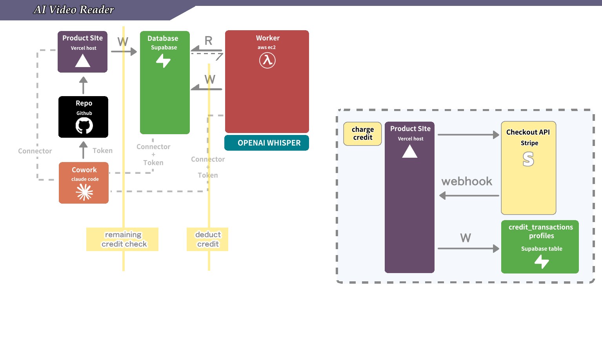

# M2 — Stripe Credits Checklist

## What this skill does

Verifies the student has actually completed M2 — not just *thinks* they have. M2 has the biggest surface area of any milestone so far: web (`/credits` + checkout + webhook routes), DB (3 new tables / columns / trigger), worker (duration probe + deduction logic), Stripe sandbox (3 prices + a working webhook forward). This checklist tests every artifact and reports pass/fail per item.

**Run this AFTER `m2-stripe-credits` Step 10, or any time the student claims M2 is done.**



*What this checklist verifies, mapped to the picture: the M1 stack on the left still works (Section A schema, Section B web, Section D worker). The two yellow bands — **"remaining credit check"** at `/api/jobs` and **"deduct credit"** at job `done` — are tested by Section E (happy path) and Section F (insufficient-credits path). The right-side dashed box (`/credits` → Stripe Checkout API → webhook back → write to `credit_transactions` + `profiles`) is verified by Section B (UI exists), Section C (Stripe sandbox is in the right state), and Section E (a real test-card purchase walks the full loop).*

## Execution mode: Cowork vs CLI (read this first)

Every check in this skill goes through MCP — consistent with M1.

| Section | CLI mode tool | Cowork mode equivalent |
|---|---|---|
| A — Schema & seed data | `supabase db execute` / dashboard | `mcp__supabase_remote__list_tables` / `execute_sql` |
| B — Web app + balance UI | `curl` + `gh api` | `mcp__vercel__*` + paste-back |
| C — Stripe sandbox | `stripe products list` / `stripe events resend` | `mcp__stripe__*` |
| D — Worker M2 patch | `aws ssm send-command ...` | `call_aws ssm send-command ...` |
| E — End-to-end happy path | `mcp__supabase_remote__execute_sql` + browser + `stripe trigger` | same |
| F — End-to-end insufficient-credits path | same as E | same |

The conversational flow is identical in both modes — only the tool selection differs.

## How to run

Invoked directly by the student (`驗收 M2`). You (Claude) **actively execute** each check.

### Step 1: Collect inputs from the student (one message)

Ask up front for:

1. GitHub repo URL (same as M1)
2. Vercel deploy URL (same as M1; now extended with `/credits`)
3. Supabase project URL (same as M1)
4. The three Stripe sandbox `price_id`s Claude created via MCP in `m2-stripe-credits` Step 3 (or the student created via CLI fallback)

If any of these is missing → stop and refer to the corresponding setup skill.

### Step 2: Preflight

Confirm the right MCPs are available:

- `mcp__supabase_remote__*` (Sections A + E + F)
- `mcp__vercel__*` (Section B)
- `mcp__stripe__*` **or** `stripe` CLI (Section C + E)
- `call_aws` (Section D)

Resolve the EC2 instance ID up front (reuse from M1):

```
INSTANCE_ID=$(call_aws ec2 describe-instances --filters "Name=tag:Name,Values=m1-worker" "Name=instance-state-name,Values=running" --query 'Reservations[0].Instances[0].InstanceId' --output text)
```

Confirm M1 is still green at the runtime level (otherwise M2 is impossible to verify):

```
call_aws ssm send-command --instance-ids "$INSTANCE_ID" --document-name AWS-RunShellScript --parameters '{"commands":["sudo systemctl is-active m1-distributor.service"]}'
```

Must return `active`. If not, switch to `m1-ai-video-transcript-checklist` Section C.

---

## Checklist

### Section A — Supabase schema + signup bonus (6 checks)

| # | Check | How to verify |
|---|---|---|
| A1 | `profiles.credits_balance` column exists | `mcp__supabase_remote__execute_sql`: `SELECT column_name, data_type, column_default FROM information_schema.columns WHERE table_name='profiles' AND column_name='credits_balance'`. Must return one row with `data_type='numeric'` and `column_default='30'` (or similar — the default must be a positive number, ideally 30). |
| A2 | `credit_transactions` table exists with M2 columns | `mcp__supabase_remote__list_tables` returns a `credit_transactions` row with at least: `id`, `user_id`, `amount`, `type`, `description`, `job_id`, `stripe_payment_intent_id`, `created_at`. |
| A3 | `credit_transactions.type` CHECK constraint includes the four expected values | `mcp__supabase_remote__execute_sql`: `SELECT pg_get_constraintdef(c.oid) FROM pg_constraint c JOIN pg_class t ON c.conrelid = t.oid WHERE t.relname = 'credit_transactions' AND c.contype = 'c'`. Output must contain `purchase`, `deduction`, `signup_bonus`, `admin_grant`. |
| A4 | UNIQUE INDEX on `stripe_payment_intent_id` | `mcp__supabase_remote__execute_sql`: `SELECT indexname FROM pg_indexes WHERE tablename='credit_transactions' AND indexname='uniq_credit_tx_payment_intent'`. Must return one row. Without this, double-credit on Stripe webhook retry is possible. |
| A5 | `credit_products` has exactly 3 active rows with the agreed tiers | `mcp__supabase_remote__execute_sql`: `SELECT name, credits, price_usd, stripe_price_id, active FROM credit_products WHERE active = true ORDER BY price_usd`. Must return 3 rows: $10/10cr, $30/45cr, $60/90cr. All three `stripe_price_id` values must start with `price_` (no `REPLACE_ME` strings — that means the migration was applied without filling in the IDs). |
| A6 | `handle_new_user` trigger grants 30 credits + writes a `signup_bonus` ledger row | `mcp__supabase_remote__execute_sql`: `SELECT pg_get_functiondef(p.oid) FROM pg_proc p JOIN pg_namespace n ON p.pronamespace = n.oid WHERE p.proname = 'handle_new_user' AND n.nspname = 'public'`. Body must contain `credits_balance` and the value `30`, AND must INSERT into `credit_transactions` with `type = 'signup_bonus'`. |

If A1 fails: M2 migration didn't apply. Re-run `mcp__supabase_remote__apply_migration` with the M2 SQL from `m2-stripe-credits` Step 3.

If A5 returns rows with `REPLACE_ME` price IDs: the student applied the migration template without substituting in the real Stripe price IDs. Patch with a follow-up migration:

```sql
UPDATE credit_products SET stripe_price_id = 'price_XXX' WHERE credits = 10;
UPDATE credit_products SET stripe_price_id = 'price_YYY' WHERE credits = 45;
UPDATE credit_products SET stripe_price_id = 'price_ZZZ' WHERE credits = 90;
```

If A6 fails: trigger function wasn't replaced. The `CREATE OR REPLACE FUNCTION` block from Step 3 must run. New signups will NOT get the 30-credit bonus until this is fixed — verifying this is critical because Section E depends on it.

### Section B — Web app (Vercel + Next.js) (8 checks)

| # | Check | How to verify |
|---|---|---|
| B1 | Vercel deploy still returns HTTP 200 | `curl -sI <vercel-url> \| head -1` shows `HTTP/2 200`. (Same as M1 B1 — confirms the M2 push didn't break the build.) |
| B2 | `/credits` page renders for signed-in users | Browser test (or `mcp__playwright__browser_navigate` if available): open `<vercel-url>/credits`, sign in. Confirm the page shows: (1) a balance display with the user's current credits, (2) three tier cards with $10/10cr, $30/45cr, $60/90cr, (3) at least the $30 and $60 tiers display a bonus badge (`+33%` or `+50%`-style label). |
| B3 | `app/api/credits/checkout/route.ts` exists | `gh api repos/<owner>/<repo>/contents/app/api/credits/checkout/route.ts --jq '.content' \| base64 -d \| head -40` shows a Next.js POST handler that imports from `@/lib/stripe` and calls `stripe.checkout.sessions.create`. |
| B4 | `app/api/stripe/webhook/route.ts` exists and uses `request.text()` not `.json()` | `gh api repos/<owner>/<repo>/contents/app/api/stripe/webhook/route.ts --jq '.content' \| base64 -d \| grep -E 'request\\.text\\(\\)\|req\\.text\\(\\)'` — must match. If `request.json()` appears instead, signature verification will fail; flag and stop. |
| B5 | `middleware.ts` exempts `/api/stripe/webhook` from auth redirects | `gh api repos/<owner>/<repo>/contents/middleware.ts --jq '.content' \| base64 -d \| grep '/api/stripe/webhook'`. Must match. If missing, all Stripe webhooks return 307 → silent failure. |
| B6 | `POST /api/jobs` rejects when balance < 1 with 402 | Manually: in browser DevTools console while signed in as a test user whose balance is 0 (set via `mcp__supabase_remote__execute_sql`: `UPDATE profiles SET credits_balance = 0 WHERE id = '<test-user-id>'`), run `fetch('/api/jobs', {method:'POST', headers:{'Content-Type':'application/json'}, body: JSON.stringify({video_source_url:'https://example.com/x.mp4', topic:'t', language:'en'})}).then(r => r.status)` — must log `402`. Remember to restore the balance after. |
| B7 | Header (or any persistent UI) shows the current credit balance | Browser test: signed in, on any non-`/credits` page, a balance indicator is visible (e.g. "Credits: 30" or a coin icon + number). Refreshing after a purchase should show the new number. |
| B8 | `STRIPE_SECRET_KEY` + `NEXT_PUBLIC_STRIPE_PUBLISHABLE_KEY` are set in Vercel production env | Cowork: `mcp__vercel__*` env-list tool. CLI: `vercel env ls production`. Must show both keys present. `STRIPE_WEBHOOK_SECRET` may or may not be present — M2 leaves it blank intentionally (it's an M3 task), so its absence is NOT a failure here. |

If B2 fails — page doesn't render or tiers don't show: most common cause is the migration didn't seed `credit_products`. Section A5 should have caught it. Otherwise the `/credits/page.tsx` server component query is broken — check the Vercel runtime logs.

If B4 fails: the student is using `request.json()` before signature verification. This will pass tests when there's no special character in the body but breaks under real Stripe payloads. Fix the route and re-push before continuing.

If B6 fails: the pre-check is either missing or broken. Read `app/api/jobs/route.ts` and confirm the SELECT + balance compare lands BEFORE the INSERT.

### Section C — Stripe sandbox (3 checks)

| # | Check | How to verify |
|---|---|---|
| C1 | Three sandbox prices exist and match the DB | Cowork: `mcp__stripe__list_prices`. CLI: `stripe prices list --limit 10`. Cross-check IDs against `credit_products.stripe_price_id` from A5 — all three must match. |
| C2 | The Stripe account is in **sandbox** mode | Cowork: prices returned by `mcp__stripe__list_prices` should have `livemode: false`. CLI: `stripe config --list` shows `device_name` and `test_mode_api_key` is what's authenticated. If `livemode: true` appears, the student accidentally activated live — abort M2 verification and have them switch back. |
| C3 | One Stripe dashboard webhook endpoint exists, pointed at the production Vercel URL, subscribed to `checkout.session.completed` | Cowork: `mcp__stripe__list_webhook_endpoints` (or equivalent). CLI: `stripe webhook_endpoints list`. Expect at least one endpoint with `enabled_events` containing `checkout.session.completed` and `url` containing your production Vercel hostname (e.g. `<repo>.vercel.app`, or the custom domain after M3). Status must be `enabled`. |

If C3 fails: either the endpoint doesn't exist (re-run `m2-stripe-credits` Step 9b) or it exists but its signing secret wasn't pasted into Vercel Production env. To verify the secret-to-env match without exposing the secret value: confirm Vercel Production scope has a non-empty `STRIPE_WEBHOOK_SECRET` via the Vercel env-list tool. Section E will fail if either side of this is broken.

### Section D — Worker M2 patch (4 checks, all via SSM)

Same SSM-only path as M1. Use `call_aws ssm send-command` with the JSON form (`--parameters '{"commands":["..."]}'` — NEVER `commands=[...]` shorthand, per [[aws-best-practice]] Rule 2).

| # | Check | How to verify |
|---|---|---|
| D1 | Worker code on EC2 references duration probing | `{"commands":["grep -E 'yt-dlp.*print.*duration\|get_duration_minutes' /home/ubuntu/app/worker/worker.py"]}` must return at least one match. If empty, the worker.py on EC2 hasn't been `git pull`ed since the M2 push — re-run M2 Step 6c. |
| D2 | Worker code references `credits_balance` and `insufficient_credits` | `{"commands":["grep -E 'credits_balance\|insufficient_credits' /home/ubuntu/app/worker/worker.py \| wc -l"]}` must return a count ≥ 2. (Expected: at least the balance read + the status update.) |
| D3 | Worker writes `credit_transactions` with `type='deduction'` | `{"commands":["grep -E \"type.*deduction\" /home/ubuntu/app/worker/worker.py"]}` must return at least one match. |
| D4 | Service was restarted after the pull | `{"commands":["systemctl show m1-distributor.service --property=ActiveEnterTimestamp"]}` — the timestamp should be within the last few hours (or whenever the student finished M2 Step 6c). If it's the same as M1's restart, the student forgot to restart the service after `git pull` — restart now: `{"commands":["sudo systemctl restart m1-distributor.service"]}`. |

If D1 fails: the EC2 has stale code. Walk the student through M2 Step 6c again.

### Section E — End-to-end happy path: buy credits + transcribe a 30-sec clip (5 checks)

This is the joined functional test.

Tell the student:

> 「請開兩個視窗：
> 1. 確認 Stripe sandbox dashboard 上有 production Vercel URL 的 webhook endpoint，並訂閱了 `checkout.session.completed`（這是 M2 Step 10b 建的）。
> 2. 瀏覽器去 `<prod-vercel-url>/credits`，先看到目前的點數（如果是新註冊就是 30 點）。
>
> 接下來請：
> 1. 點 $10 / 10 點 那一檔，結帳時用下面的測試卡資訊填表（**不要填你的真實卡號或姓名**）。
> 2. 回到 `/credits`，確認點數變成 40 點（30+10）。
> 3. 回到 `/upload`，貼一個 30 秒短片（Internet Archive 或直接 mp4 都可以，**不要用 YouTube** — 見 [[whisper-best-practice]] Rule 3）。
> 4. 提交，等 1–3 分鐘看 status 變成 `done`。
>
> 全部做完跟我說『跑完了』。」

##### Stripe sandbox test card reference

These are Stripe-published test values. Only work against `sk_test_*` keys. (M2 main skill §9d has the same table — duplicated here so the checklist is self-contained.)

| Field | Value |
|---|---|
| **Card number** | `4242 4242 4242 4242` (Visa, always succeeds) |
| **Expiry** | any future MM/YY (`12/34` works) |
| **CVC** | any 3 digits (`123`) |
| **ZIP / postal code** | any (`94103`, `00000`, anything) |
| **Cardholder name** | anything fake (`Test User`) — NOT your real name |
| **Email** (if asked) | anything fake (`test@example.com`) — NOT your real email |

Alternative cards for edge-case verification (all sandbox-only):

- `4000 0000 0000 0002` → declined (`card_declined`). Use this to manually confirm the `/credits` page handles a failed checkout without crashing — not required for M2 pass, but a 2-minute optional gut-check.
- `4000 0025 0000 3155` → triggers 3D Secure auth. Stripe Checkout owns the UI; your handler just needs to not break.

Full list: https://docs.stripe.com/testing

When the student confirms:

| # | Check | How to verify |
|---|---|---|
| E1 | A `purchase` row exists for this user with the right amount | `mcp__supabase_remote__execute_sql`: `SELECT amount, type, stripe_payment_intent_id, description FROM credit_transactions WHERE user_id = '<test-user-id>' AND type = 'purchase' ORDER BY created_at DESC LIMIT 1`. `amount` must be 10, `stripe_payment_intent_id` must be a `pi_...` string. |
| E2 | `profiles.credits_balance` was incremented by exactly 10 | Cross-check against pre-purchase balance. If the student had 30 (new signup), expect 40 after. If the page shows a different number, look for: (1) the webhook hitting `409`/`23505` because the migration's unique index wasn't applied (Section A4), (2) the worker simultaneously deducting because a job completed during the same window. |
| E3 | The 30-sec clip job reached `status='done'` | `mcp__supabase_remote__execute_sql`: `SELECT status, video_source_url, created_at FROM jobs WHERE user_id = '<test-user-id>' ORDER BY created_at DESC LIMIT 1`. Status must be `done`. |
| E4 | A `deduction` row was written for the done job | `mcp__supabase_remote__execute_sql`: `SELECT amount, type, job_id, description FROM credit_transactions WHERE user_id = '<test-user-id>' AND type = 'deduction' ORDER BY created_at DESC LIMIT 1`. `amount` must be negative (e.g. `-1` for a 30-sec clip rounded up to 1 minute). `job_id` must match the row from E3. |
| E5 | `profiles.credits_balance` was decremented by exactly the deduction amount | After E2 you expected 40. If the clip was 30s (1 minute rounded up), expect 39. The math: `signup_bonus + purchase - deduction_minutes = current_balance` over the whole user's history. Run: `SELECT SUM(amount) FROM credit_transactions WHERE user_id = '<test-user-id>'` — must equal `profiles.credits_balance`. If those two don't match, there's a balance drift bug. |

If E1–E2 pass but E3–E5 fail: the worker didn't pick up the new code. Re-verify Section D, especially D4 (service restart).

If E5 fails but E3 passes: the balance update in `worker.py` after the `done` write isn't running. Read the worker log: `call_aws ssm send-command --instance-ids "$INSTANCE_ID" --document-name AWS-RunShellScript --parameters '{"commands":["sudo tail -50 /var/log/m1-distributor.log"]}'`. Look for an error around the `credits_balance` UPDATE.

### Section F — Insufficient-credits path (3 checks)

This proves the *gate* actually gates. The student needs to test both the soft submit-floor (B6) and the worker-side hard check (this section).

Tell the student:

> 「再做一次測試：
> 1. 用 `mcp__supabase_remote__execute_sql`（或 dashboard 改）把這個測試帳號的 `credits_balance` 設成 5 點。
> 2. 提交一段**確定超過 5 分鐘**的影片（找一段 6–8 分鐘的演講 mp4 或 archive.org 的 podcast 都行）。
> 3. 等 worker 跑（30 秒到 1 分鐘）。
>
> 跑完跟我說『跑完了』。」

When the student confirms:

| # | Check | How to verify |
|---|---|---|
| F1 | Job status is `insufficient_credits` (NOT `done`, NOT `error`) | `mcp__supabase_remote__execute_sql`: `SELECT status FROM jobs WHERE user_id = '<test-user-id>' ORDER BY created_at DESC LIMIT 1`. Must be `insufficient_credits`. If it's `error`, the worker tried to call Whisper anyway and Whisper rejected the input — read the worker log. If it's `done`, the duration check didn't fire; re-verify D1/D2. |
| F2 | `profiles.credits_balance` was NOT decremented | The user's balance must still be 5. M2's contract is "insufficient → no charge". If it dropped, the deduct logic ran despite the early `return` in the worker — read the worker.py and find the early-exit. |
| F3 | Whisper was NOT called for this job | Read the worker log: `call_aws ssm send-command --instance-ids "$INSTANCE_ID" --document-name AWS-RunShellScript --parameters '{"commands":["sudo tail -100 /var/log/m1-distributor.log"]}'`. Grep for OpenAI / Whisper API calls in the relevant timestamp range. The expected output: a log line like `insufficient credits — video is N min, balance 5 cr` and NO `whisper-1` POST. If you see a Whisper call, the duration check didn't short-circuit before Whisper. |

If F1 fails: the duration probe (Section D, M2 Step 6a) isn't being called or its result isn't being compared correctly. Read `worker.py` and verify the math: `minutes = ceil(seconds / 60)` then `if minutes > balance`.

### Section G — Cleanup (2 checks)

| # | Check | How to verify |
|---|---|---|
| G1 | No `whsec_` or `sk_test_` / `sk_live_` value ever committed to git | `git log -p --all -S 'whsec_' \| head` should show no matches. Same for `sk_test_` and `sk_live_`. If anything matches, treat the leaked secret as compromised: in the Stripe dashboard, roll the matching key (Settings → Developers → API keys) OR delete + recreate the webhook endpoint (Developers → Webhooks → … → delete) — then update the corresponding value in Vercel env and redeploy. M2 keeps all secrets in Vercel env exclusively, so a leak in git history would only have happened via deliberate copy-paste. |
| G2 | Test users from Section E and F are documented as test, or deleted | Tell the student: "If you used a personal account for these tests, that's fine. If you created a throwaway account, delete it from Supabase Auth + the corresponding `profiles` row." Pure hygiene — doesn't gate M2 completion. |

---

## Verdict

If A1–F3 all pass: **M2 is complete and live on your production Vercel URL.** A real user could sign up right now, get 30 free credits, click Buy, run a Stripe Checkout against the sandbox, and watch the worker transcribe their video while their credit balance updates from the webhook. That is a complete SaaS payment system — schema, UI, payment provider, webhook, ledger, worker-side metering — all yours.

The course's next milestone (M3) adds a custom domain on top of the same sandbox-based flow. Real-money activation is an optional course extension (it requires phone + bank + business info from Stripe).

If anything failed, here's where to look — the M2 build is layered so each fix only needs one section:

- **Schema (A)** → `m2-stripe-credits` Step 4, re-apply the migration
- **Web (B)** → `m2-stripe-credits` Steps 5 (`/credits` page), 6 (API routes), 8 (`/api/jobs` pre-check + balance badge)
- **Stripe (C)** → MCP/CLI auth broken: `m2-stripe-credits-prerequisites` Section 2. Three prices missing or wrong: `m2-stripe-credits` Step 3. Webhook endpoint missing: `m2-stripe-credits` Step 9b.
- **Worker (D)** → `m2-stripe-credits` Step 7 (duration check + deduction)
- **E2E happy (E)** / **insufficient-credits (F)** → start with the worker log via SSM, fix whichever layer the log finger-points at

Re-run this checklist after every fix until everything is green. Each green section is a real piece of working SaaS infrastructure you built.

## Related skills

- [[m2-stripe-credits]] — the main M2 walkthrough that this skill verifies
- [[m2-stripe-credits-prerequisites]] — the Stripe sandbox account + MCP/CLI auth this skill assumes is done
- [[m1-ai-video-transcript-checklist]] — must be green before M2 can be verified
- [[aws-best-practice]] — the SSM JSON-form parameter rule used throughout Section D
- [[whisper-best-practice]] — Rule 3 (no YouTube for cloud-IP tests) applies to the E2E happy-path test in Section E
- [[supabase-best-practice]] — migration discipline; if A1–A6 fail it's almost always a migration not landing
- [[milestone-payment-stripe]] — production-side Stripe with escrow + refund; use as a "this is what M2 grows into" reference
