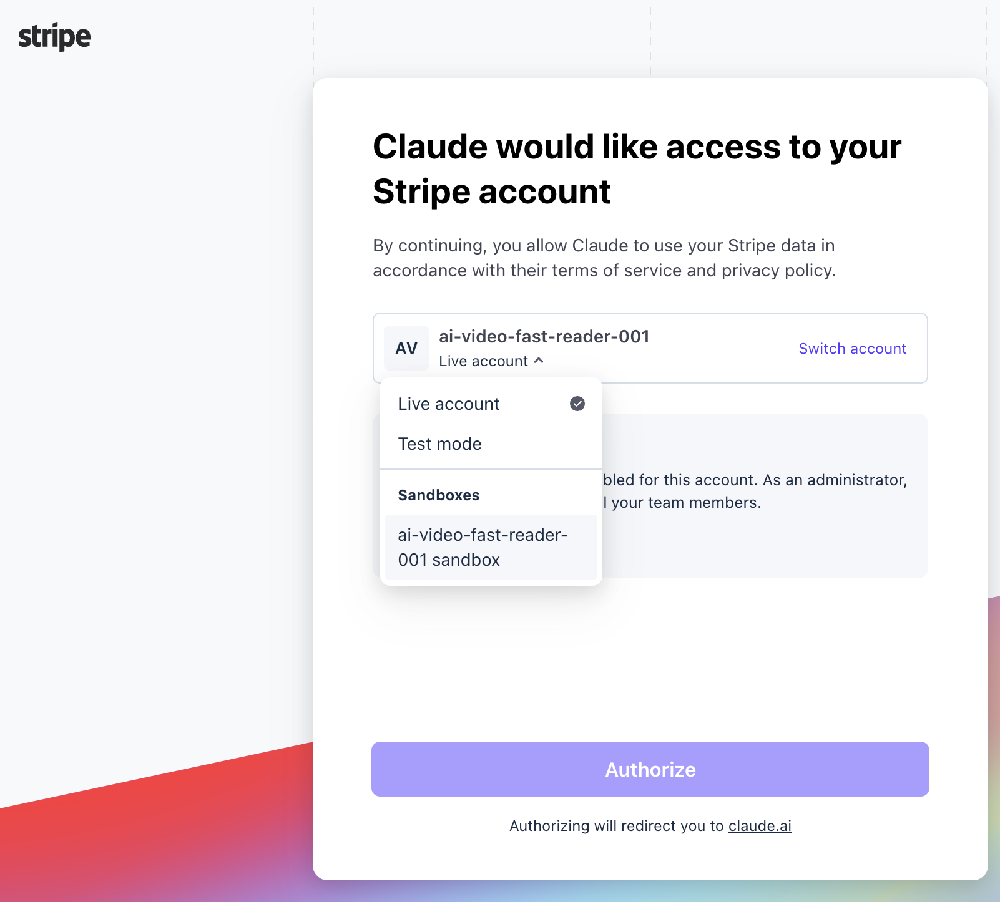

# M2 Prerequisites — Stripe sandbox + CLI / MCP

## What this skill does

Adds **one** new account on top of M1's five (GitHub / Supabase / Vercel / OpenAI / AWS) and gets Stripe's local webhook loop working. No new infra — M2 reuses M1's Vercel + Supabase + EC2 unchanged.

| # | Service | Used for |
|---|---|---|
| 7 | **Stripe (sandbox)** | Checkout Sessions + webhook for credit purchases |

By the end of this skill the student has:

1. A Stripe **sandbox** account with a test publishable key (`pk_test_...`) and test secret key (`sk_test_...`).
2. Either Stripe MCP (Cowork) **or** the Stripe CLI (CLI mode) authenticated against the sandbox.
3. **One verified read against that auth** — proves the credentials work and the account is in sandbox mode (`livemode: false`), without running anything locally.

That's it. No products, no prices, no migrations, no webhook handlers, no `.env.local` edits, no `npm run dev`. The full end-to-end webhook test — Stripe → real handler → DB write — happens in the main `m2-stripe-credits` skill, exercised against the **deployed Vercel URL**, not against `localhost`.

> **Why no local smoke test?** A local Next.js dev server pulls the student into shell territory (`npm`, ports, dev-server lifecycle, `.env.local` hygiene) that diverges between Mac / Linux / Windows / WSL. The prereq's job is to make sure the *external accounts* are wired up, not to debug `npm run dev` exit codes on Windows. Verification of the actual webhook loop happens in main M2 Step 9, where it can lean on the already-deployed Vercel URL and a Stripe dashboard endpoint — both stable, both OS-independent.

**Sandbox only.** Live keys, the live-mode price re-link, and the production endpoint secret are all deferred to **M3** (custom domain + go-live). Building M2 entirely against sandbox keeps the test card `4242 4242 4242 4242` available and avoids any real-money path until the student is ready.

> **Why no new AWS / Supabase / OpenAI work in M2?** The worker doesn't talk to Stripe — Stripe talks to a new Next.js webhook route. The EC2 worker only gains one new responsibility: **probe the video duration via yt-dlp, compare to the user's `profiles.credits_balance`, and either deduct on `done` or set status `insufficient_credits` before calling Whisper.** That code change ships with M2's main skill, but it requires zero new infra — `yt-dlp` is already on the EC2 from M1 prereq §2.6.

## What this prereq is preparing for (the picture)


*M1 (left) — already built. M2's new surface (right, dashed box) — the Product Site calls Stripe's **Checkout API**, Stripe pushes a **webhook** back, the Product Site writes the purchase into `credit_transactions` + `profiles`. The two yellow bands inside the M1 box are M2's enforcement points: **"remaining credit check"** at submit and **"deduct credit"** when the worker finishes. This prereq prepares only the leftmost piece of the dashed box — the **Stripe account** and the **authenticated MCP/CLI** that everything else in M2 depends on. The actual webhook delivery is exercised end-to-end in main M2 Step 9, against the deployed Vercel URL.*

## Required MCPs (read this first)

| MCP | Status | Notes |
|---|---|---|
| `mcp__supabase_remote__*` | ✅ already installed for M0 | Used to apply the M2 ledger migration |
| `mcp__vercel__*` | ✅ already installed for M0 | Used to list deployments and tail logs. **Does NOT support env-var management as of 2026-05** — Stripe env vars go in via the Vercel dashboard. |
| `call_aws` (AWS API MCP) | ✅ already installed for M1 | Only used to redeploy the worker after the duration-check change. Use the **shorthand** `commands=[...]` form for `--parameters` — the MCP's argv parser breaks on the JSON form. |
| **`mcp__stripe__*`** | **add in this skill** | Cowork path for creating products, listing prices. **Does NOT support webhook endpoint management as of 2026-05** — the M2 webhook endpoint is created via the Stripe dashboard. |

If you're in **CLI mode** and don't want to install the Stripe MCP, the `stripe` CLI (`brew install stripe/stripe-cli/stripe` on macOS, or the Linux equivalent) is sufficient for all of M2 — used for `stripe products create`, `stripe prices create`, `stripe webhook_endpoints create`, and `stripe events resend`. (Main M2 doesn't use `stripe listen` — the webhook test goes against a real Stripe **dashboard endpoint** pointed at Vercel, not a local forwarder.)

> **Why call out the MCP gaps here?** Past students hit both gaps mid-build and lost time looking for tools that don't exist. The main M2 skill calls these out again at the relevant steps; this matrix is the early heads-up.

## Section 1 — Create the Stripe sandbox account

1. Go to https://dashboard.stripe.com/register, sign up with the same email you use for the course.
2. After verification, Stripe drops you into a **sandbox** account by default (top-left switcher shows "Sandbox"). Stay there. Do NOT click "Activate your account" — activation flips you into live mode and locks you out of test cards. The full course runs in sandbox, including M3's custom-domain milestone. Activating live is an optional path after the course for students who want to accept real payments (it asks for phone number, bank account, and business info — beyond course scope).
3. **Developers → API keys** (or top-right ⋯ → Developers → API keys):
   - **Publishable key:** `pk_test_...` — copy. Safe to embed in client code.
   - **Secret key:** `sk_test_...` — click *Reveal* once, copy. Goes into Vercel env (Production scope — set up in main M2 Step 2a), **never** into client code or git.

Hold onto both. They're injected via Vercel env in the main M2 skill Step 1.

> **Why sandbox-first:** the sandbox is a fully-featured replica of the live account with test cards enabled. You can re-issue keys, delete products, and replay any event without worrying about real customers. Live mode is a separate set of keys, products, and prices — and is unrecoverable for any accidental real charge.

## Section 2 — Install + authenticate the Stripe MCP (Cowork — required path)

Sections 3 and 4 below both go through the Stripe MCP. Install it first.

> **Why MCP-first?** With the MCP authenticated, the main M2 skill's Step 3 becomes "Claude creates your three prices for you" — no dashboard clicking, no CLI install. The student authorizes once via OAuth and then everything else in M2 (price creation, webhook forwarding, event resending) happens through the same MCP. The Stripe CLI is documented as a fallback in §2b for students who can't / won't use Cowork.

### 2a — Stripe Connector (Cowork web — primary path)

For students using Cowork at `claude.ai/code` (the web UI), Stripe is exposed as a **Connector** — a one-click integration that Cowork manages on your behalf. There is no callback-URL paste-back, no MCP install command, no `mcp__stripe__authenticate` to run. You enable it from the Connectors panel, click through Stripe's consent page once, and Cowork wires the rest up server-side.

1. In Cowork: open the **Connectors** panel (left sidebar or settings, depending on your Cowork version) and find **Stripe**. Click **Connect** / **Enable**.
2. Cowork opens Stripe's **"Claude would like access to your Stripe account"** consent page in a new tab. **The account selector defaults to "Live account" — this is the foot-gun. You must switch it to your sandbox before clicking Authorize.**

   

   Three things to do on this consent page, in order:

   **2a.i — Switch to your sandbox.** Click **Switch account** in the top-right of the account card (where the screenshot shows the open dropdown). The dropdown lists three sections:

   - **Live account** ← the default. **Do NOT pick this.** Anything Claude creates here costs real money.
   - **Test mode** ← legacy "test mode" on the live account. Works for sandboxes-style testing but uses the same `acct_...` as live. Not recommended for this course.
   - **Sandboxes** ← the fully-isolated sandbox accounts (each has its own `acct_...`). **Pick the one named `<your-account-name> sandbox`** (e.g. `ai-video-fast-reader-001 sandbox` in the screenshot).

   If you don't see any sandbox entries, your Stripe account doesn't have a sandbox yet — go to https://dashboard.stripe.com/test/sandboxes and click **Create sandbox** first, then refresh the consent page. Confirm the selected account now shows the sandbox name (not "Live account").

   **2a.ii — Enable MCP access for the sandbox (if prompted).** After switching to the sandbox, you may see a banner that says:

   > **MCP access is currently disabled for this sandbox.** As an administrator, you can turn access on for all your team members.
   >
   > **\[Enable for this sandbox\]**

   This is a per-sandbox safety toggle Stripe adds for fresh sandboxes. **Click "Enable for this sandbox"** (you must be the sandbox admin — for a personal course account, you are). The banner disappears and the permissions matrix below it becomes interactive.

   If the banner says "MCP access is disabled for this sandbox" but offers no button, you're not an admin on this sandbox. Use a sandbox you own, or have the owner enable it.

   **2a.iii — Grant the minimum permissions.** Below the banner is a long matrix of permission categories — Accounts, Balance, Charges and Refunds, Coupons, Customers, Disputes, Invoices, Payment Intents, Payment Links, Payment Method Configurations, Prices, Products, Promotion Codes, Subscriptions, Payout Methods, PII in tool responses — each with **None / Read / Write** radios. At the bottom is a default-preset button labelled **"Authorize (Mostly Write)"**.

   You have two choices:

   - **Easy path (recommended for the course):** click **Authorize (Mostly Write)** as-is. This grants broad scopes including ones M2 doesn't use (Subscriptions, Invoices, etc.), but you're inside a *sandbox* — no real-money risk, and you'll find broad scopes useful in M3+ if you experiment.
   - **Minimum-scope path (if you want to lock it down):** set all categories to **None**, then flip these to the listed values:
     - **Products: Write** — needed for main M2 Step 3 (`create_product`)
     - **Prices: Write** — needed for main M2 Step 3 (`create_price`)
     - **Accounts: Read** — for the `livemode: false` verification in Section 3
     - All others: **None**

     Then click **Authorize**. (Webhook endpoint creation in main M2 Steps 9b / 10b uses an internal scope not listed in this matrix — it's covered by the OAuth grant regardless of the matrix selections. If it ever fails with a 403, come back to https://dashboard.stripe.com/settings/apps → Claude → edit scopes.)

3. After clicking Authorize, your browser is redirected back to Cowork. The Connectors panel should now show **Stripe: Connected** with the sandbox account name. **Cowork handled the OAuth redirect server-side — no `localhost:` URL to paste, no `mcp__stripe__complete_authentication` to run.**
4. Verify by asking Claude to list prices — Claude calls a `list_prices` tool on the Stripe MCP and reports back. If the account is fresh, the list is empty. That's fine — the main `m2-stripe-credits` skill creates the three prices in its Step 3. Section 3 below does the formal verification including a `livemode: false` check.

> **What if you clicked Authorize while "Live account" was still selected?** The MCP is now scoped to your live account, and anything Claude creates with it would cost real money. **Fix immediately** (do NOT proceed to Section 3): go to https://dashboard.stripe.com/settings/apps → find the Claude app entry → click **Revoke access**. Then come back to Cowork, disconnect the Stripe Connector, re-Connect, and on the consent page pick the sandbox in the dropdown before clicking Authorize.

### 2a-alt — Stripe MCP via Claude Code CLI (paste-back path)

If you're running Claude Code in your **local terminal** (not the Cowork web UI), Stripe is exposed as a *per-session MCP server* — not a managed Connector. The OAuth redirect lands at `http://localhost:<port>/callback?...`, which your CLI process can't auto-receive, so you finish the handshake by pasting the callback URL back to Claude. This is the only meaningful difference from the Cowork path.

1. Confirm the Stripe MCP server entry exists in your project's `.mcp.json` (or wherever you configure MCPs for Claude Code CLI). If not, add it pointing at `https://mcp.stripe.com`.
2. In Claude Code, ask Claude to start the OAuth flow:

   > 「請幫我啟動 Stripe MCP 的授權」 / "Start the Stripe MCP authentication"

   Claude calls `mcp__stripe__authenticate` and prints a `https://access.stripe.com/mcp/oauth2/authorize?...` URL.
3. Open that URL in your browser. Follow the **exact same** consent-page steps as §2a.i, §2a.ii, §2a.iii above (switch to sandbox → enable MCP for sandbox if prompted → grant permissions → Authorize). The screenshot, the foot-guns, and the minimum scopes are identical — only the wrapper around the consent page is different.
4. Your browser redirects to `http://localhost:<port>/callback?code=...&state=...`. The page likely shows a "can't connect" / "site can't be reached" error — **that's expected**. The URL in your browser's address bar is still valid.
5. Copy the **full URL from the address bar** (it must start with `http://localhost:` and contain `code=` and `state=` params) and paste it back to Claude. Claude calls `mcp__stripe__complete_authentication` with it. The MCP is now live for this session.
6. Verify by asking Claude to list prices — same as §2a step 4.

> **Why two different flows?** In Cowork (web), the Cowork backend has a stable, addressable callback URL it can register with Stripe ahead of time, so the OAuth redirect lands somewhere it can auto-pick up the code. In CLI, Claude Code spins up an ephemeral local listener at `http://localhost:<random-port>/callback` per auth attempt — Stripe's redirect lands there, but if you're on a remote SSH session or a sandboxed terminal there's no guarantee the redirect's network round-trip will reach it. The paste-back gives the CLI a manual path to receive the code regardless. Cowork students never see this; CLI students always do.

> **Why the consent page defaults to Live, not Sandbox.** Stripe assumes OAuth consents are for production integrations (live billing on partner platforms). The course case — a learner wiring an AI assistant to a sandbox — is the minority. The Stripe team can't read your intent; the selector is there for you. The screenshot above is your "stop and check" moment.

### 2b — Stripe CLI (fallback path — if you can't use Cowork)

If you're in pure CLI mode without the Cowork connector directory, install the Stripe CLI instead. Everything Sections 3 and 4 do via MCP also works via CLI — the steps just shift onto your shell.

```bash
# macOS
brew install stripe/stripe-cli/stripe

# Linux (snap)
sudo snap install --classic stripe

# Or: download the binary from https://github.com/stripe/stripe-cli/releases
```

Authenticate against sandbox:

```bash
stripe login
# opens a browser tab; click "Allow access" against your sandbox account
# the prompt's "Pairing code" must match what's shown in the browser
```

Verify:

```bash
stripe prices list
# returns an empty list if the account is fresh — that's fine, the main M2 skill's Step 3 creates the prices
```

If you see `acct_live_...` in the auth flow, you accidentally clicked "Activate" in Section 1 — switch the dashboard toggle to Sandbox and re-run `stripe login`.

## Section 3 — Verify the auth is real (one read, no local work)

This is the lightest possible verification: ask Stripe one read-only question and confirm the answer comes back with the right account and the right mode. No products created, no webhooks fired, no dev server, no `.env.local` writes. If you can read prices (even an empty list), then your Stripe auth — whether via the Cowork Connector (§2a) or the CLI MCP (§2a-alt) or `stripe login` (§2b) — is wired up and the main M2 skill won't fail on its first MCP call.

### 3a — Read once and confirm

**Cowork (Stripe MCP):** ask Claude verbatim:

> 「幫我用 Stripe MCP 列出 prices（list_prices 或等效）。我要確認三件事：
> 1. 回傳沒有 401 / 403 / auth error。
> 2. 回傳的 prices 都標著 `livemode: false`（或回傳為空，表示帳號是新的）。
> 3. 順便用 `retrieve_account` / `get_account` 之類的 tool 把 account ID 印出來給我，我要看到 `acct_...` 前綴。」

Claude makes the read calls and reports back.

**CLI fallback:**
```bash
stripe prices list --limit 1
# returns either an empty list (fresh account) or one price with "livemode": false

stripe config --list | grep -E "account|test_mode"
# expect: test_mode_api_key set; live_mode_api_key NOT set
```

### 3b — Expected outcomes

| Outcome | What it tells you |
|---|---|
| Empty list returned, no error | ✅ Auth is good. Account is fresh — main M2 Step 3 will create the three tiers. |
| Non-empty list, every row `livemode: false` | ✅ Auth is good, account is in sandbox. Pre-existing prices are fine — main M2 Step 3 just adds three more. |
| `401 Unauthorized` / `invalid_api_key` | ❌ Re-run §2a (OAuth flow) or §2b (`stripe login`). The MCP / CLI auth didn't actually take. |
| Any row with `livemode: true` | ❌ **STOP.** You authorized against live mode by accident. Revoke immediately: https://dashboard.stripe.com/settings/apps → find the Claude app entry → **Revoke access** (or `stripe logout` for CLI). Then redo §2a/§2b, and on the consent page click **Switch account** → pick the **Sandboxes → `<account-name> sandbox`** entry before clicking Authorize. Anything main M2 creates against live costs real money. |

That's the whole verification. Two minutes. The actual webhook end-to-end test happens in **main M2 Step 9**, against the deployed Vercel URL — where it can lean on Stripe's dashboard endpoint feature and skip the entire local-shell rabbit hole (`stripe listen` ports, `npm run dev` startup, OS-specific PATH for the Stripe CLI on Windows, etc.).

> **What about catching webhook delivery issues earlier?** They get caught in main M2 Step 9 when the student wires up the dashboard endpoint pointed at `https://<vercel-url>/api/stripe/webhook` and clicks "Send test webhook" from the dashboard — same `checkout.session.completed` payload, same `<-- [200]` confirmation, but delivered to a real Next.js handler with the real signature secret. No localhost involved, no platform-specific issues, and the test infrastructure (the dashboard endpoint) is something M2 needs anyway for go-live.

## Section 4 — End-of-course cleanup reminder

When the course is done, before deactivating the sandbox:

- **Stripe sandbox keys:** rotate `sk_test_...` if it was ever shared (e.g. screenshared during a live lecture). Dashboard → Developers → API keys → roll secret key.
- **Stripe MCP / CLI session:** in Cowork, disconnect the Stripe MCP connector. From CLI, `stripe logout`.
- **Live mode (only relevant after M3):** if you've activated live, audit that `sk_live_...` only ever exists in Vercel **production** env (via `vercel env add` or the MCP), never in any local file, screenshot, or commit history.

Add a calendar reminder ~6 weeks out: "Rotate Stripe sandbox keys + disconnect Stripe MCP if Course 2 is done."

## Sanity check before starting `m2-stripe-credits`

Before invoking the main M2 skill, confirm:

1. `pk_test_...` and `sk_test_...` are in hand (Section 1).
2. Stripe MCP is authenticated against your **sandbox** account, OR `stripe login` succeeded against sandbox (Section 2).
3. The Section 3 read returned without an auth error, and every row in the response was `livemode: false` (or the list was empty).
4. M1 is fully green per `m1-ai-video-transcript-checklist` — M2 builds on the working upload + worker loop, and if M1 is broken, you can't smoke-test M2.

If 1–3 fail, fix here. If 4 fails, switch to the M1 checklist first.

## Related skills

- [[m1-ai-video-transcript-checklist]] — must be green before this skill is useful
- [[m2-stripe-credits]] — the main M2 walkthrough that this skill prepares for
- [[m2-stripe-credits-checklist]] — verifies M2 after the main skill is done
- [[stripe-best-practices]] — generic Stripe API guidance (Checkout vs PaymentIntents, restricted keys, etc.)
- [[milestone-payment-stripe]] — the production Stripe integration in this repo (escrow + refund flow); reference this when you're ready to add the v2 enhancements after shipping M2
- [[supabase-best-practice]] — migration discipline for the M2 ledger schema
