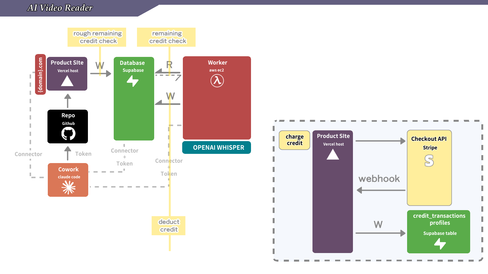

# M3 — Custom Domain Checklist

## What this skill does

Verifies the student has actually completed M3 — not just *thinks* they have. M3 is deceptively simple (no code changes), but DNS misconfiguration is silent: the subdomain "works" in one browser but not another, or HTTPS loads but auth breaks because the redirect URL wasn't updated. This checklist tests every layer from the Route 53 registration through to a working authenticated session on the product subdomain.

**The product URL pattern this checklist verifies:** `https://ai-video-speed-reader.<your-domain>.com` — a subdomain CNAMEd to Vercel. The apex (`<your-domain>.com`) is **intentionally unconfigured** in M3 and should NOT be expected to resolve.

**Run this AFTER `m3-custom-domain` Step 4 (the last step), or any time the student claims M3 is done.**



*What this checklist verifies: DNS resolution from Route 53 to Vercel for the subdomain (Section A), Vercel domain configuration + HTTPS (Section B), Supabase auth on the new subdomain (Section C), and the M2 stack still working through the subdomain (Section D).*

## Execution mode: Cowork vs CLI

| Section | CLI mode tool | Cowork mode equivalent |
|---|---|---|
| A — Route 53 DNS | `aws route53 ...` / `dig` / `nslookup` | `call_aws route53 ...` |
| B — Vercel domain + HTTPS | `curl -sI https://<subdomain>` / Vercel dashboard | `mcp__vercel__*` + browser |
| C — Supabase auth | `mcp__supabase_remote__execute_sql` + browser | same |
| D — M2 regression | `mcp__supabase_remote__execute_sql` + browser | same |

## How to run

Invoked directly by the student (`驗收 M3`). You (Claude) **actively execute** each check.

### Step 1: Collect inputs from the student (one message)

Ask up front for:

1. **Apex domain** (e.g. `christine003.com`) — the domain registered in prereqs Section 4
2. **Product subdomain** — should be `ai-video-speed-reader.<apex>` (e.g. `ai-video-speed-reader.christine003.com`)
3. **Vercel project URL** (the old `.vercel.app` URL — to verify it still works alongside the subdomain)
4. **Supabase project URL** (same as M1/M2)

If any is missing → stop and refer to the corresponding setup skill.

### Step 2: Preflight

Confirm the right connectors/MCPs are available:

- `call_aws` (AWS API MCP) — Section A
- `mcp__vercel__*` — Section B
- `mcp__supabase_remote__*` — Sections C + D

Resolve the hosted zone ID for the apex:

```
call_aws route53 list-hosted-zones-by-name --dns-name <apex> --max-items 1
```

Must return a hosted zone. Save the zone ID for Section A checks.

---

## Checklist

### Section A — Route 53 domain + DNS (5 checks)

| # | Check | How to verify |
|---|---|---|
| A1 | Apex domain is registered in Route 53 | `call_aws route53domains get-domain-detail --domain-name <apex>` — must return without error. Check `StatusList` does not contain `clientHold` (ICANN verification not completed). |
| A2 | Auto-renew is enabled | Same `get-domain-detail` response: `AutoRenew` must be `true`. If false, the domain expires after 1 year without warning — set via `call_aws route53domains enable-domain-auto-renew --domain-name <apex>`. |
| A3 | WHOIS privacy protection is enabled | Same `get-domain-detail` response: `AdminPrivacy`, `RegistrantPrivacy`, `TechPrivacy` must all be `true`. |
| A4 | Hosted zone exists with correct NS delegation | `call_aws route53 list-resource-record-sets --hosted-zone-id <zone-id> --query "ResourceRecordSets[?Type=='NS']"` — must return 4 NS records. Cross-check: `call_aws route53domains get-domain-detail --domain-name <apex> --query 'Nameservers'` — the NS servers from the registrar must match the hosted zone's NS records. If they don't match, the hosted zone is orphaned (domain points to different name servers). |
| A5 | CNAME for the product subdomain points to Vercel | `call_aws route53 list-resource-record-sets --hosted-zone-id <zone-id> --query "ResourceRecordSets[?Type=='CNAME' && Name=='ai-video-speed-reader.<apex>.']"` — must return one record with `Value` = `cname.vercel-dns.com` (or `cname.vercel-dns.com.` with trailing dot). |

**Note:** No A record on the apex is expected — M3 deliberately leaves the apex unconfigured. If you find an apex A record, it's either left over from an earlier draft (clean it up) or the student deviated from the M3 plan.

If A1 fails with `DomainNotFound`: the domain wasn't registered via Route 53 — re-run `m3-custom-domain-prerequisites` Section 4.

If A1 returns `clientHold` in `StatusList`: the ICANN verification email was not confirmed. Tell the student to check their email and click the verification link. The domain is suspended until they do.

If A4 NS mismatch: the hosted zone was created manually after registration, or the domain was transferred from another registrar without updating NS records. Fix: update the domain's name servers to match the hosted zone: `call_aws route53domains update-domain-nameservers --domain-name <apex> --nameservers Name=ns-XXX.awsdns-XX.com Name=...`.

If A5 missing: the CNAME from `m3-custom-domain` Step 2 wasn't created. Re-run the `change-resource-record-sets` call.

### Section B — Vercel domain + HTTPS (4 checks)

| # | Check | How to verify |
|---|---|---|
| B1 | Product subdomain is attached to the Vercel project | `mcp__vercel__get_project` (using `projectId` + `teamId` from `mcp__vercel__list_projects`) — the returned project's `alias` / `domains` field must include `ai-video-speed-reader.<apex>`. Cross-check: `vercel domains ls` (CLI) or Vercel dashboard → Project → Settings → Domains, with ✅ status. If `get_project` returns the subdomain but `verification` field still has outstanding TXT challenges, DNS hasn't fully propagated — wait, then re-check. |
| B2 | `https://ai-video-speed-reader.<apex>` returns HTTP 200 | `curl -sI https://ai-video-speed-reader.<apex> \| head -1` → `HTTP/2 200`. If Cowork, open the URL in a browser. |
| B3 | TLS certificate is valid and covers the subdomain | `curl -vI https://ai-video-speed-reader.<apex> 2>&1 \| grep -i 'subject\|issuer\|expire'` — subject must include the subdomain, issuer should be Let's Encrypt (or similar), expiry should be in the future. In browser: click the 🔒 icon → Certificate → confirm the subdomain is listed. |
| B4 | The old `.vercel.app` URL still works | `curl -sI https://<repo-name>.vercel.app \| head -1` → `HTTP/2 200`. The `.vercel.app` URL must continue to work — the Stripe webhook endpoint still points here. If it 404s or redirects to the subdomain, check Vercel's redirect rules. |

If B2 fails after A5 passes: DNS is correct but Vercel hasn't provisioned the TLS cert yet. Wait 5 minutes and retry. If still failing after 10 minutes, remove and re-add the subdomain in Vercel Settings → Domains.

If B3 shows an expired or wrong-domain cert: Vercel's auto-renewal may have failed. Remove and re-add the subdomain.

If B4 fails: **critical**. The Stripe webhook depends on this URL. Do NOT proceed until the `.vercel.app` URL is restored. Check if a Vercel redirect rule is sending `.vercel.app` traffic to the subdomain (this is fine for users, but breaks if the redirect applies to POST requests like webhooks). Verify by testing a POST: `curl -sX POST https://<repo-name>.vercel.app/api/stripe/webhook -d '{}' | head`.

### Section C — Supabase auth on the new subdomain (3 checks)

| # | Check | How to verify |
|---|---|---|
| C1 | Supabase **Site URL** is set to the product subdomain | Supabase dashboard → Authentication → URL Configuration → Site URL. Must be `https://ai-video-speed-reader.<apex>`. If it still says `https://<repo-name>.vercel.app`, auth emails (password reset, magic link) will link to the old URL. Update it. |
| C2 | Supabase **Redirect URLs** include the product subdomain | Same page → Redirect URLs. Must contain `https://ai-video-speed-reader.<apex>/**` (wildcard for all paths). The old `.vercel.app` redirect should also still be present (don't delete it). |
| C3 | Sign-in works on the product subdomain | Browser test: go to `https://ai-video-speed-reader.<apex>`, sign out if signed in, sign back in. The auth flow must complete without errors. Check the browser URL bar — at no point should it redirect to `.vercel.app` during the auth flow (it should stay on the subdomain throughout). |

If C3 fails with a redirect error: C1 or C2 is wrong. The most common cause is the redirect URL missing the `/**` wildcard — Supabase does exact-prefix matching, so `https://ai-video-speed-reader.<apex>` alone won't match `https://ai-video-speed-reader.<apex>/auth/callback`.

### Section D — M2 regression test (4 checks)

M3 should not break M2. Quick smoke test to confirm the credit system still works through the subdomain.

| # | Check | How to verify |
|---|---|---|
| D1 | `/credits` page loads on the subdomain | Browser: `https://ai-video-speed-reader.<apex>/credits` — must show balance + 3 tier cards (same as M2 B2). |
| D2 | Credit balance is visible in the header | Same as M2 B7 — a balance indicator is visible in the header/nav while signed in. |
| D3 | `credit_products` still has 3 active rows | `mcp__supabase_remote__execute_sql`: `SELECT name, credits, price_usd FROM credit_products WHERE active = true ORDER BY price_usd` — must return 3 rows ($10/10cr, $30/45cr, $60/90cr). |
| D4 | Stripe webhook endpoint still exists and is enabled | Stripe dashboard → Developers → Webhooks. At least one endpoint must be `enabled` with `checkout.session.completed` in its events. The URL should be `https://<repo-name>.vercel.app/api/stripe/webhook` (the `.vercel.app` URL — M3 deliberately does NOT change this). |

> **Optional but recommended:** if the student has time, run a quick $10 test-card purchase through `https://ai-video-speed-reader.<apex>/credits` (same as M2 checklist Section E, but via the subdomain). This proves the full loop: subdomain → Stripe Checkout → webhook to `.vercel.app` → credits land in Supabase. If the student is short on time, D1–D4 are sufficient.

If D1 fails: the Vercel deploy may be broken (independent of M3). Check Vercel deployment status.

If D4 is missing: the Stripe webhook endpoint was accidentally deleted. Re-create per `m2-stripe-credits` Step 9b.

### Section E — Cleanup (2 checks)

| # | Check | How to verify |
|---|---|---|
| E1 | No DNS credentials committed to git | `git log -p --all -S 'route53' \| head` — should show no AWS access keys or secret keys. Route 53 operations go through the MCP, so credentials should never appear in the repo. |
| E2 | Auto-renew is documented | Tell the student: "Your domain will auto-renew in 1 year. Add a calendar reminder for ~11 months out to decide if you want to keep it, or disable auto-renew in Route 53 before the renewal charge." |

---

## Verdict

If A1–D4 all pass: **M3 is complete.** Your SaaS product now lives at `https://ai-video-speed-reader.<your-domain>.com` — a real custom subdomain with HTTPS, backed by Route 53 DNS, served by Vercel, with the full M2 credit system working through it. That's what users see when they visit a real product.

The apex (`<your-domain>.com`) is intentionally unconfigured — reserved for the student's future projects. The `.vercel.app` URL continues to work in parallel (Stripe webhook depends on it). The subdomain is purely additive — nothing was removed, nothing was broken.

If anything failed:

- **Domain registration** → `m3-custom-domain-prerequisites` Section 4 (registered via AWS Console)
- **DNS (A)** → `m3-custom-domain-prerequisites` Section 4 (hosted zone) and `m3-custom-domain` Step 2 (CNAME for subdomain)
- **Vercel (B)** → `m3-custom-domain` Step 1 (add subdomain in Vercel) and Step 3 (verify HTTPS)
- **Auth (C)** → `m3-custom-domain` Step 4 (Supabase redirect URLs)
- **M2 regression (D)** → `m2-stripe-credits-checklist` (fix M2 first, then re-verify M3)

Re-run this checklist after every fix until everything is green.

## Related skills

- [[m3-custom-domain]] — the main M3 walkthrough that this skill verifies
- [[m3-custom-domain-prerequisites]] — the connector check + domain selection this skill assumes is done
- [[m2-stripe-credits-checklist]] — must be green before M3 can be verified (Section D is a subset)
- [[aws-best-practice]] — Route 53 operations follow the same IAM user from M1
