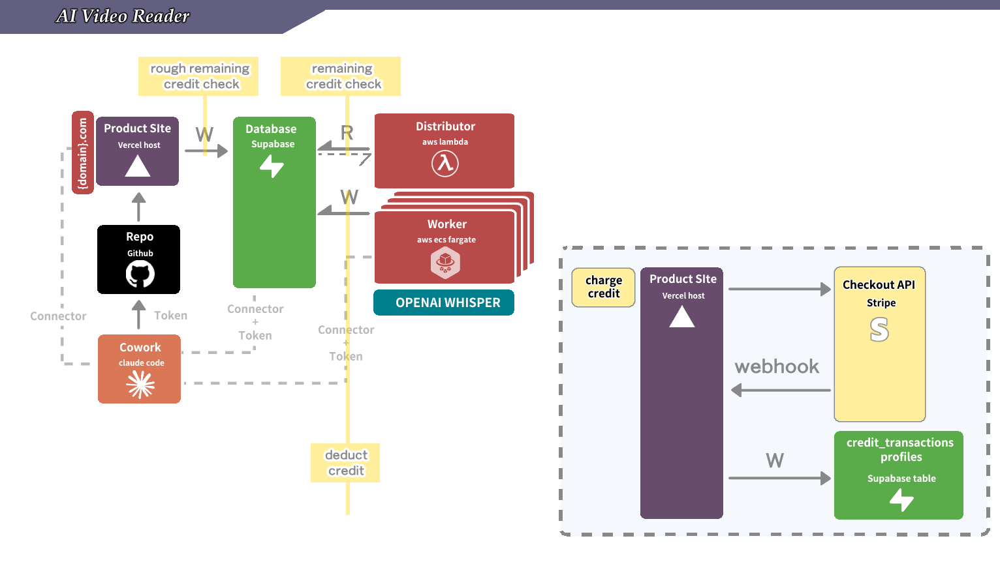

# M4 — Fully Serverless Scaling (Lambda + Fargate, no EC2)

> **這一節是進階優化，不是必修。** M0–M3 結束時你的產品已經能上線、能收錢、有自己的網域 — 已經是一個會賺錢的 SaaS。M4 是當你流量長起來（同時跑很多影片）或想把伺服器成本壓到趨近 $0、不再付 always-on EC2 的錢時才做。M2 結束時的 EC2 + Vercel 部署模型完全可以撐你前 6 個月。

## What this skill does

Walks the student through Course 2 Milestone 4 end-to-end. By the end the student has a fully serverless worker with **no EC2 anywhere in the live path or the build path**:

1. The worker (the same `worker.py` pipeline from M1, ffmpeg baked in) packaged as a **Docker image in Amazon ECR** — built by **AWS CodeBuild**, sourced straight from the **GitHub repo**.
2. An **ECS Fargate** cluster + task definition that runs one container per job — isolated CPU/memory, no contention, **no 15-minute limit** (handles any video length).
3. A **Lambda distributor** that polls Supabase for pending jobs and calls `ecs:RunTask` per job — replacing M1's `distributor.py`.
4. An **EventBridge schedule** (`rate(1 minute)`) firing the Lambda — replacing the always-on EC2 + `tmux` loop.
5. The M1 **EC2 worker terminated (or stopped)** — and, crucially, **nothing depends on it anymore**: the build runs on CodeBuild, the work runs on Fargate, the loop runs on Lambda.

**Why this shape.** The worker shells out to the **ffmpeg binary** (download → transcode → chunk → Whisper) and pulls heavy deps (`yt-dlp`, `moviepy`, `pydub`, …). That's a poor fit for a Lambda (15-min cap, no ffmpeg, `/tmp` limits) but a perfect fit for a **container on Fargate** — ffmpeg + every dep just bake into the image, and a long video has no time ceiling. The **distributor**, by contrast, only polls a table and fires `RunTask` — tiny, fast, every minute — which is the ideal **Lambda + EventBridge** job. So M4 splits M1's EC2 into the two serverless services each half fits best. (This is also exactly what the production stack runs.)

**The one thing that's easy to get wrong — and how M4 avoids it.** Building the Docker image needs Docker on an x86_64 Linux host. The obvious-but-wrong answer is "build it on the M1 EC2" — but the whole point of M4 is to *remove* that EC2, so depending on it to build the very image that replaces it is a trap. **M4 builds the image with AWS CodeBuild** — an on-demand, managed Docker build that pulls source from GitHub, builds, pushes to ECR, and disappears. No EC2, no local Docker, no SSH. Cowork-friendly (all `call_aws`).

## GitHub's role in M4: load-bearing build source (not just documentation)

The student **edits the worker/infra files in the workspace and pushes them to their own GitHub repo.** In M4 that push is **required, not optional** — CodeBuild reads the repo as its build source, so **if the worker code isn't pushed, there is no image to build.** GitHub is load-bearing here, not a "for the record" nicety.

Be precise about which files are build-critical vs. record-only:

| File | Role | If not pushed |
|---|---|---|
| `worker/Dockerfile`, `worker/worker.py` (+ `requirements.txt`), `buildspec.yml` | **Build-critical** — CodeBuild checks them out and runs `docker build` against them | **CodeBuild builds nothing (or builds stale code).** The Fargate worker never gets the new image. |
| `worker/lambda_distributor.py` | **Record-only** — the Lambda is deployed via `call_aws lambda` from a zip, *not* by CodeBuild | The Lambda still works (you deploy it directly), but the repo no longer matches what's running. Push it anyway. |
| migration SQL | **Record-only** — applied via Supabase MCP/CLI | Same — applied independently; commit it so the schema is reproducible. |

So: **the worker push feeds the build; the Lambda/migration push keeps the repo honest.** Both should happen, but only the first is on the critical path to a working image.

Lambda + Fargate themselves are created/updated with `call_aws` (and CodeBuild for the image). **Deployment is manual `call_aws`, not a GitHub-triggered pipeline** — pushing feeds the build source; you trigger the build and the deploys explicitly. (Auto-build-on-push is a v2 roadmap item; CDK to make the repo the full deploy source is another.)

## When to do M4 (and when to skip it)

**Do M4 when:** you want the worker to cost $0 while you sleep · you don't want to babysit an always-on EC2 · concurrent jobs lag on the single EC2 · you want unlimited concurrency and any video length without resizing a box.

**Skip M4 when:** still validating the product · MAU < 100 · ECS/Fargate/CodeBuild names make your head hurt. The M1 EC2 worker is genuinely fine for a first product — going serverless is an optimization you earn, not a box you must tick.

## When to load this skill

Trigger phrases: 「啟動 M4」 / "start M4" · "go serverless" · "Lambda + Fargate" · 「把 EC2 關掉」 / "remove the always-on EC2" · any prompt about scaling the worker off the always-on box.

Do NOT load this for M0/M1/M2/M3 — they have their own skills. If the student hasn't finished M1 (a working EC2 worker), **stop** — M4 has nothing to migrate from.

## Required external accounts

Same six as M3 — **no new accounts**:

| # | Service | Used for | Added in |
|---|---|---|---|
| 1 | GitHub | Source control — **+ CodeBuild source (M4)** | M0 |
| 2 | Supabase | Auth + Postgres + RLS | M0 |
| 3 | Vercel | Auto-deploy Next.js | M0 |
| 4 | OpenAI | Whisper (`whisper-1`) | M1 |
| 5 | AWS | EC2 (M1) → **ECR + ECS Fargate + Lambda + EventBridge + CodeBuild (M4)** | M1 |
| 6 | Stripe (sandbox) | Checkout Sessions + webhook | M2 |

M4 adds **five AWS services** (ECR, ECS Fargate, Lambda, EventBridge, CodeBuild) inside the **same AWS account** from M1. No new signup. If the AWS connector isn't authenticated, **stop and load `m4-serverless-prerequisites` first**.

## Required Cowork connectors / MCPs

| # | Connector / MCP | Used in M4 for |
|---|---|---|
| 1 | `call_aws` / `suggest_aws_commands` (AWS API MCP) | ECR, ECS, Lambda, EventBridge, CodeBuild, IAM — the bulk of M4 |
| 2 | `mcp__supabase_remote__*` | Schema migration (`fargate_task_arn`) + checklist verification |
| 3 | `mcp__vercel__*` | Not changed by M4, but the app must stay green |
| 4 | `mcp__stripe__*` | Not used in M4, but M2/M3 must remain green |

> **No local Docker needed, and no EC2.** Unlike a build-on-EC2 design, M4 never builds a container locally or on the EC2 — **CodeBuild** does it in the cloud. The student only needs `call_aws` + a GitHub push.

## The shape of the final system



*Same product as M3. The worker compute lane changes: M1's always-on EC2 (running `distributor.py` in tmux) is replaced by EventBridge → Lambda distributor → Fargate tasks, with the worker image built by CodeBuild from GitHub. Everything else — Vercel, Supabase, Stripe, the domain — is untouched.*

Text-tree of M4's two flows — **build-time** and **run-time** — neither touches the EC2:

```
BUILD-TIME (once per worker code change):
  edit worker/ + buildspec.yml → git push to GitHub repo
       └─ call_aws codebuild start-build   (source = GitHub repo)
            └─ ephemeral x86_64 builder: docker build → docker push → ECR

RUN-TIME (every job):
  [Browser] → [Vercel] → POST /api/jobs → [Supabase: jobs + job_sessions]
                                                ▲          │ status='pending'
                                                │          ▼
                          [EventBridge: rate(1 minute)]
                                                │
                          [Lambda: distributor]
                             ├─ SELECT pending WHERE fargate_task_arn IS NULL
                             ├─ ecs:RunTask  (one Fargate task per job, fire-and-forget)
                             └─ UPDATE job_sessions SET fargate_task_arn = <arn>
                                                │
                                                ▼
                          [ECS Fargate task]  (one container per job, any length)
                             ├─ image pulled from ECR (ffmpeg + deps baked in)
                             ├─ claim_job → yt-dlp → ffmpeg → OpenAI Whisper, chunked
                             └─ write subtitle_*_content back to job_sessions
```

**The two state changes vs M1:** `distributor.py` → Lambda (now async/scheduled, `ecs:RunTask` instead of a local subprocess), and the worker subprocess → a Fargate task (same `worker.py`, now containerized). **The new column:** `job_sessions.fargate_task_arn` carries the idempotency the stateless Lambda can't keep in memory — it only spawns jobs `WHERE fargate_task_arn IS NULL` and writes the ARN right after `RunTask`.

## Execution mode (single path — Claude Code driving MCPs)

| Component | Operation | How |
|---|---|---|
| **Supabase** | Add `fargate_task_arn` column | `mcp__supabase_remote__apply_migration` (Cowork) / migration file + `supabase db push` (CLI). **Always a migration file** (see [[supabase-best-practice]]). |
| **GitHub** | Push worker `Dockerfile` + `buildspec.yml` + Lambda handler | normal `git push` (auth per environment — see prereq §4a). Source of truth + CodeBuild input. |
| **CodeBuild** | Build the worker image from GitHub → ECR | `call_aws codebuild create-project` / `start-build` / `batch-get-builds`. **No EC2, no local Docker.** |
| **ECR** | Hold the worker image | `call_aws ecr create-repository`; CodeBuild pushes. |
| **ECS** | Cluster + task definition | `call_aws ecs create-cluster` / `register-task-definition`. |
| **IAM** | Task exec role, worker task role, Lambda role, **CodeBuild role** | `call_aws iam create-role` / `attach-role-policy` / `put-role-policy`. |
| **Lambda** | Distributor + deps layer | `call_aws lambda create-function` / `publish-layer-version`. |
| **EventBridge** | `rate(1 minute)` → Lambda | `call_aws events put-rule` / `put-targets`; `lambda add-permission`. |
| **EC2 (M1)** | Stop or terminate the old worker | `call_aws ec2 stop-instances` / `terminate-instances`. Nothing depends on it after M4. |

## Conversational flow

Drive the student through the steps below. **Don't dump them all at once.** After each, **wait for confirmation**. Each step ends with a "verify before moving on" you must actually run.

> **Before Step 1:** confirm `m4-serverless-prerequisites` is done — connectors green, M1 worker confirmed working, region noted, GitHub push auth resolved.

> **⚠️ One distributor per Supabase at a time.** M1's EC2 `distributor.py` and the new Lambda **must not both poll the same Supabase** — they'll each spawn a task for the same job (double Whisper billing). Step 7 stops the EC2 distributor *before* enabling the EventBridge rule. Never enable both.

---

### Step 1 — Add the `fargate_task_arn` idempotency column

Migration (never raw SQL — see [[supabase-best-practice]]):
```sql
-- supabase/migrations/<timestamp>_add_fargate_task_arn_to_job_sessions.sql
ALTER TABLE job_sessions ADD COLUMN IF NOT EXISTS fargate_task_arn TEXT;
CREATE INDEX IF NOT EXISTS idx_job_sessions_unspawned
  ON job_sessions (id) WHERE fargate_task_arn IS NULL;
```
Apply — **Cowork:** `mcp__supabase_remote__apply_migration`; **CLI:** file + `supabase db push`.

**Verify:** `SELECT column_name FROM information_schema.columns WHERE table_name='job_sessions' AND column_name='fargate_task_arn'` returns one row.

---

### Step 2 — Add the worker `Dockerfile` + `buildspec.yml` and push to GitHub

The worker image needs the M1 `worker.py` pipeline + ffmpeg + deps. CodeBuild builds it from these two files in the repo.

**2a. `worker/Dockerfile`** (ffmpeg baked in — the worker shells out to it):
```dockerfile
FROM python:3.12-slim
RUN apt-get update && apt-get install -y --no-install-recommends ffmpeg \
    && rm -rf /var/lib/apt/lists/*
WORKDIR /app
COPY requirements.txt .
RUN pip install --no-cache-dir -r requirements.txt
COPY worker.py .
# JOB_ID + Supabase + OpenAI + Anthropic creds arrive as env from the Lambda's RunTask override.
CMD ["python", "worker.py"]
```

**2b. `buildspec.yml`** (at the repo root, or set its path in the CodeBuild project) — logs in to ECR, builds, pushes `latest`:
```yaml
version: 0.2
phases:
  pre_build:
    commands:
      - aws ecr get-login-password --region $AWS_DEFAULT_REGION | docker login --username AWS --password-stdin $ECR_URI
  build:
    commands:
      - docker build -t $ECR_URI:latest ./worker
  post_build:
    commands:
      - docker push $ECR_URI:latest
```
CodeBuild runs on x86_64 Linux, so the image matches Fargate — **no `--platform` flag needed.**

**2c. Push to GitHub** — derive the repo URL, **never hardcode it** (each student's repo differs). Auth depends on environment (Cowork = PAT pasted into the session; laptop = existing `gh`/keychain) — see prereq §4a:
```bash
git -C <repo> remote get-url origin     # discover the repo
git -C <repo> add worker/Dockerfile buildspec.yml && git -C <repo> commit -m "M4: worker image + buildspec" && git -C <repo> push origin main
```
Confirm with the student before pushing (outward action).

**Verify:** the two files are visible on the repo's default branch.

---

### Step 3 — Create the ECR repo + the CodeBuild project, then build

**3a. ECR repo:**
```
call_aws ecr create-repository --repository-name subtitle-worker
```
Note the `repositoryUri` (`<acct>.dkr.ecr.<region>.amazonaws.com/subtitle-worker`).

**3b. CodeBuild service role** — needs ECR push + CloudWatch logs:
```
call_aws iam create-role --role-name subtitleCodeBuildRole \
  --assume-role-policy-document '{"Version":"2012-10-17","Statement":[{"Effect":"Allow","Principal":{"Service":"codebuild.amazonaws.com"},"Action":"sts:AssumeRole"}]}'
call_aws iam attach-role-policy --role-name subtitleCodeBuildRole --policy-arn arn:aws:iam::aws:policy/AmazonEC2ContainerRegistryPowerUser
call_aws iam attach-role-policy --role-name subtitleCodeBuildRole --policy-arn arn:aws:iam::aws:policy/CloudWatchLogsFullAccess
```

**3c. Create the CodeBuild project** — GitHub source, Linux container, **privileged mode** (required for `docker build`):
```
call_aws codebuild create-project --name subtitle-worker-build \
  --source 'type=GITHUB,location=https://github.com/<gh-user>/<repo>.git,buildspec=buildspec.yml' \
  --artifacts 'type=NO_ARTIFACTS' \
  --environment 'type=LINUX_CONTAINER,image=aws/codebuild/standard:7.0,computeType=BUILD_GENERAL1_SMALL,privilegedMode=true,environmentVariables=[{name=ECR_URI,value=<repositoryUri>}]' \
  --service-role <subtitleCodeBuildRole ARN>
```
> **`privilegedMode=true` is mandatory** — without it the build container can't run the Docker daemon and `docker build` fails. This is the CodeBuild equivalent of the arch/Docker traps in a local build.
> **GitHub source auth:** a public repo needs nothing. A private repo needs CodeBuild connected to GitHub once — `call_aws codebuild import-source-credentials --token <PAT> --server-type GITHUB --auth-type PERSONAL_ACCESS_TOKEN` (the PAT needs `repo` scope; it's stored in CodeBuild, used only at build time).

**3d. Build:**
```
call_aws codebuild start-build --project-name subtitle-worker-build
```

**Verify before moving on:** poll the build to completion, then confirm the image:
```
call_aws codebuild batch-get-builds --ids <build-id from start-build>   # buildStatus → SUCCEEDED
call_aws ecr list-images --repository-name subtitle-worker              # shows latest
```
If `buildStatus` is `FAILED`, read the CodeBuild logs (`call_aws logs ...` for the project's log group) — usual causes: missing `privilegedMode`, ECR login perms, or a `buildspec.yml` path mismatch.

---

### Step 4 — ECS Fargate cluster + task roles + task definition

**4a. Cluster:** `call_aws ecs create-cluster --cluster-name subtitle-workers`

**4b. Two IAM roles:**
- **Task execution role** — pull image from ECR + write logs. Attach `AmazonECSTaskExecutionRolePolicy`.
- **Worker task role** — what the running worker needs (essentially nothing AWS-side; it talks to Supabase/OpenAI over HTTPS via env creds). Keep minimal, separate from exec role.
```
call_aws iam create-role --role-name subtitleTaskExecutionRole --assume-role-policy-document '{"Version":"2012-10-17","Statement":[{"Effect":"Allow","Principal":{"Service":"ecs-tasks.amazonaws.com"},"Action":"sts:AssumeRole"}]}'
call_aws iam attach-role-policy --role-name subtitleTaskExecutionRole --policy-arn arn:aws:iam::aws:policy/service-role/AmazonECSTaskExecutionRolePolicy
call_aws iam create-role --role-name subtitleWorkerTaskRole --assume-role-policy-document '{"Version":"2012-10-17","Statement":[{"Effect":"Allow","Principal":{"Service":"ecs-tasks.amazonaws.com"},"Action":"sts:AssumeRole"}]}'
```

**4c. Register the task definition:**
```
call_aws ecs register-task-definition --family subtitle-worker \
  --requires-compatibilities FARGATE --network-mode awsvpc --cpu 1024 --memory 2048 \
  --execution-role-arn <subtitleTaskExecutionRole ARN> --task-role-arn <subtitleWorkerTaskRole ARN> \
  --container-definitions '[{"name":"worker","image":"<repositoryUri>:latest","essential":true,
    "logConfiguration":{"logDriver":"awslogs","options":{"awslogs-group":"/ecs/subtitle-worker","awslogs-region":"<region>","awslogs-stream-prefix":"worker","awslogs-create-group":"true"}}}]'
```

**Verify + optional one-shot sanity test** (prove image/roles/env before wiring the Lambda):
```
call_aws ecs run-task --cluster subtitle-workers --task-definition subtitle-worker --launch-type FARGATE \
  --network-configuration 'awsvpcConfiguration={subnets=[<subnet>],assignPublicIp=ENABLED}' \
  --overrides '{"containerOverrides":[{"name":"worker","environment":[{"name":"JOB_ID","value":"<a real pending job>"},{"name":"SUPABASE_URL","value":"..."},{"name":"SUPABASE_SERVICE_KEY","value":"..."},{"name":"OPENAI_API_KEY","value":"..."}]}]}'
```
`assignPublicIp=ENABLED` on a public subnet so the task reaches the internet without a NAT gateway. Watch the job advance in Supabase + `/ecs/subtitle-worker` logs.

---

### Step 5 — Build the Lambda distributor + its deps layer

The Lambda replaces `distributor.py`: on each tick it (1) `SELECT`s pending jobs `WHERE fargate_task_arn IS NULL`, calls `ecs.run_task`, writes the ARN; (2) does stuck-job recovery (new session N+1); (3) daily storage cleanup (DB-timestamp gated). It imports **only** `boto3` + `supabase` — **no OpenAI/Anthropic** (it forwards those keys to the Fargate task via `containerOverrides[].environment`).

> **The distributor's deps layer is tiny (`supabase` + `boto3`) — no Docker needed.** Build the small zip with `pip download --platform manylinux2014_x86_64 --only-binary=:all:` from the workspace (or any x86_64 pip), zip, and `publish-layer-version`. (CodeBuild handled the heavy worker image; the Lambda layer is light enough to need no container build.) Commit `worker/lambda_distributor.py` to the repo for the record.

**5a. Layer:**
```
call_aws lambda publish-layer-version --layer-name subtitle-distributor-deps \
  --content S3Bucket=<bucket>,S3Key=deps-layer.zip --compatible-runtimes python3.12
```

**5b. Lambda execution role** — `ecs:RunTask`/`DescribeTasks`/`StopTask`, `iam:PassRole` scoped to the two task roles from Step 4, plus `AWSLambdaBasicExecutionRole`.

**5c. Create the function** (stage the handler zip via S3 in Cowork):
```
call_aws lambda create-function --function-name subtitle-distributor \
  --runtime python3.12 --handler lambda_distributor.handler --role <Lambda role ARN> \
  --layers <deps layer ARN> --timeout 300 --memory-size 256 \
  --code S3Bucket=<bucket>,S3Key=handler.zip \
  --environment 'Variables={SUPABASE_URL=...,SUPABASE_SERVICE_KEY=...,OPENAI_API_KEY=...,ANTHROPIC_API_KEY=...,ECS_CLUSTER=subtitle-workers,TASK_DEFINITION=subtitle-worker,SUBNETS=<subnet>}'
```

**Verify:** `get-function` → `State: Active`. Manual one-shot `call_aws lambda invoke` → confirm in CloudWatch the spawn pass ran and (if a pending job exists) a Fargate task launched + ARN landed in `job_sessions.fargate_task_arn`.

---

### Step 6 — Wire the EventBridge schedule (but don't enable until Step 7)

```
call_aws events put-rule --name subtitle-distributor-schedule --schedule-expression 'rate(1 minute)'
call_aws lambda add-permission --function-name subtitle-distributor --statement-id eventbridge-invoke \
  --action lambda:InvokeFunction --principal events.amazonaws.com --source-arn <rule ARN>
call_aws events put-targets --rule subtitle-distributor-schedule --targets 'Id=1,Arn=<Lambda ARN>'
```

---

### Step 7 — Stop the EC2 distributor, THEN confirm the rule is live

**Order matters** — never run both distributors on one Supabase. Stop EC2 *first*.

**7a. Stop the M1 EC2 distributor + the instance** (you can `terminate` now — nothing depends on it; or `stop` if you want a brief safety window). Via SSM, no SSH:
```
call_aws ssm send-command --instance-ids <id> --document-name "AWS-RunShellScript" --parameters 'commands=["tmux kill-session -t worker || pkill -f distributor.py || true"]'
call_aws ec2 stop-instances --instance-ids <id>     # or terminate-instances once you're confident
```

**7b. Ensure the rule is ENABLED:** `call_aws events enable-rule --name subtitle-distributor-schedule`.

**Verify:** EC2 `stopped`/`terminated`; rule `ENABLED` at `rate(1 minute)`; after ~2 min, CloudWatch `/aws/lambda/subtitle-distributor` shows it firing each minute.

---

### Step 8 — End-to-end proof + redeploy loop

1. Submit a real job on the product URL; within ~1 min the Lambda spawns a Fargate task and stamps `fargate_task_arn`; the next tick skips it (idempotency).
2. Job advances `pending → … → done` on Fargate; logs in `/ecs/subtitle-worker`. EC2 is `stopped`/`terminated` throughout.
3. **Future worker changes** = edit `worker/`, `git push`, `call_aws codebuild start-build`, then either let new Fargate tasks pull `:latest` or force-new. **No EC2 ever re-enters the loop.**

Run `m4-serverless-checklist` for the full sweep.

---

## Post-M4 state

| Layer | After M1 / M3 | After M4 |
|---|---|---|
| Distributor | Always-on EC2 `distributor.py` (~$15/mo) | Lambda on EventBridge `rate(1 min)` (~$1.50/mo) |
| Worker compute | Single EC2 CPU shared | Isolated Fargate task per job, **any video length** |
| Image build | (ran on the EC2) | **CodeBuild** from GitHub — no EC2, no local Docker |
| Concurrency | Bounded by EC2 size | Effectively unlimited |
| Cost when idle | EC2 24/7 | ~$0 (scales to zero) |
| Idempotency | In-memory `_spawned_jobs` | DB `job_sessions.fargate_task_arn` |
| EC2 | Running | **Stopped or terminated — nothing depends on it** |
| Web / DB / Stripe / domain | — | **Unchanged** |

## Switching back to the EC2 fallback

Only if you kept the EC2 stopped (not terminated):
```
call_aws events disable-rule --name subtitle-distributor-schedule   # disable FIRST
call_aws ec2 start-instances --instance-ids <id>
call_aws ssm send-command --instance-ids <id> --document-name "AWS-RunShellScript" --parameters 'commands=["cd /home/ubuntu/app && tmux new -d -s worker ./venv/bin/python distributor.py"]'
```
Re-enable the rule only after stopping the EC2 distributor again. **One distributor per Supabase, always.** (If you terminated the EC2, the fallback is gone — that's the intended end state.)

## Future enhancements (v2 roadmap)

- **CDK / IaC.** M4 is provisioned imperatively via `call_aws` so the student sees each piece. Today the repo is CodeBuild's *build source* for the worker image, but the AWS resources (CodeBuild project, ECR, ECS, Lambda, EventBridge, IAM) are created by hand. Capture them in CDK so the whole stack is `cdk deploy`-able and the repo becomes the full deploy source, not just the image source.
- **CodeBuild on push (CI).** Add a GitHub webhook / `start-build` trigger so pushing worker changes auto-rebuilds the image — turning the manual `start-build` into a pipeline.
- **Dev + prod stacks.** Two distributors + clusters, same code, different env vars, one per Supabase/stage.
- **Lambda-only tier for short videos.** For a cheaper tier that skips Fargate entirely, a single worker Lambda can transcribe short clips directly (accepting the 15-min cap with a clear error on long videos). Useful as a low-end option; Fargate remains the any-length path.
- **Terminate the EC2 + clean up** its KeyPair/SG if you only stopped it.

## Related skills

- [[m4-serverless-prerequisites]] — connector check + GitHub push auth + M1-green confirmation
- [[m4-serverless-checklist]] — verifies M4 after this skill completes
- [[m1-ai-video-transcript]] — the EC2 worker M4 migrates away from (same `worker.py`, now containerized)
- [[aws-best-practice]] — IAM, SSM-not-SSH, region rules apply to every `call_aws` here
- [[supabase-best-practice]] — the `fargate_task_arn` column must go through a migration file
- [[project-2-ai-video-reader]] — the full M0→M4 architecture progression
